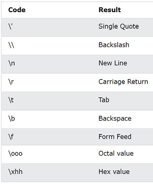
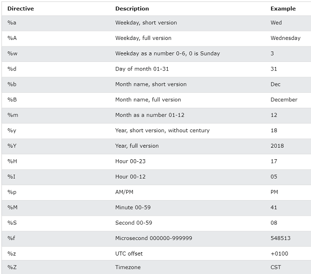
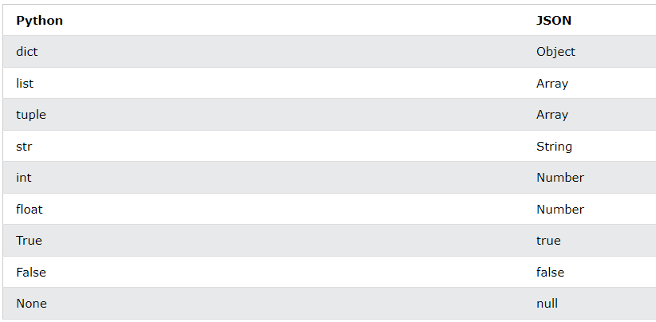

```Text
Author: Antony_Weng <weng851107@gmail.com>

This file is only used for the record of the learning process, only used by myself and the file has never been leaked out.
If there is related infringement or violation of related regulations, please contact me and the related files will be deleted immediately. Thank you!
```

# 目錄

- [Note](#0)
  - [學習資源](#0.1)
  - [技術網站](#0.2)
- [實際操作](#2)
  - [Telnet](#2.1)
  - [matplotlib極座標應用](#2.2)
  - [tkinter UI](#2.3)
  - [Uart](#2.4)
  - [Excel](#2.5)
  - [OpenCV](#2.6)
- [相關知識](#3)
  - [如何在linux下執行python程式](#3.1)
  - [Ubuntu修改默認Python版本](#3.2)
  - [套件管理工具 pip 指令用法](#3.3)
    - [requirements.txt](#3.3.1)
  - [Ubuntu python 安裝](#3.4)
  - [Linux python 內建虛擬環境--venv](#3.5)
- [Python Tutorial](#4)
  - [Syntax](#4.1)
  - [Variables](#4.2)
  - [Data Types](#4.3)
  - [Numbers](#4.4)
  - [Casting](#4.5)
  - [Strings](#4.6)
  - [Booleans](#4.7)
  - [Operators](#4.8)
  - [Collections (Arrays)](#4.9)
  - [Lists](#4.10)
  - [Tuples](#4.11)
  - [Sets](#4.12)
  - [Dictionaries](#4.13)
  - [If ... Else](#4.14)
  - [While Loops](#4.15)
  - [For Loops](#4.16)
  - [Functions](#4.17)
  - [Lambda](#4.18)
  - [Arrays](#4.19)
  - [Classes and Objects](#4.20)
  - [Inheritance](#4.21)
  - [Iterators](#4.22)
  - [Scope](#4.23)
  - [Modules](#4.24)
  - [Datetime](#4.25)
  - [Math](#4.26)
  - [JSON](#4.27)
  - [RegEx](#4.28)
  - [PIP](#4.29)
  - [Try Except](#4.30)
  - [User Input](#4.31)
- [交叉編譯ARM架構Python](#5)
  - [交叉編譯介紹](#5.1)
  - [python及其第三方庫的交叉編譯背景](#5.2)
  - [交叉編譯的準備工作](#5.3)
  - [交叉編譯python及其第三方的思路](#5.4)
  - [準備交叉編譯工具](#5.5)
  - [準備openssl-build](#5.6)
  - [準備openssl-target](#5.7)
  - [準備zlib-build](#5.8)
  - [準備zlib-target](#5.9)
  - [準備c*-build](#5.10)
  - [準備c*-target](#5.11)
  - [編譯python-build](#5.12)
  - [編譯python-target](#5.13)
  - [通過crossenv交叉編譯第三方庫例如：numpy](#5.14)
  - [移植到目標板子](#5.15)
- [File Handling](#6)
  - [File Open](#6.1)
  - [Read Files](#6.2)
  - [Write/Create Files](#6.3)
  - [Delete Files](#6.4)


<h1 id="0">Note</h1>

<h2 id="0.1">學習資源</h2>

[Python Tutorial - W3Schools](https://www.w3schools.com/python/default.asp)

[Python Tutorial - GeeksforGeeks](https://www.geeksforgeeks.org/python-programming-language/?ref=ghm)

[菜鳥教程 - Python3](https://www.runoob.com/python3/python3-tutorial.html)

[STEAM教學網 - Python 教學](https://steam.oxxostudio.tw/category/python/index.html)

[OpenCV-Python Tutorials](https://docs.opencv.org/4.x/d6/d00/tutorial_py_root.html)

[STEAM教學網 - OpenCV 教學](https://steam.oxxostudio.tw/category/python/ai/opencv-index.html)

[OpenCV 函式庫](https://steam.oxxostudio.tw/category/python/ai/opencv.html)

<h2 id="0.2">技術網站</h2>

[如何在python中执行另一个py文件](https://cloud.tencent.com/developer/article/1738484)

[Linux和Windows下用python找到并杀死进程](https://beltxman.com/3406.html)

[Python string 轉 bytes 的 3 種方法](https://shengyu7697.github.io/python-string-to-bytes/)

[基於python goto的正確用法說明](https://walkonnet.com/archives/22204)

[變量類型 & 進位制](https://ithelp.ithome.com.tw/articles/10284114)

[Python 字串格式化教學與範例](https://officeguide.cc/python-string-formatters-tutorial/)

[Python的 Convert Hex to Float value](https://andy851220.medium.com/python%E7%9A%84hex-to-float-value-ce228d90bc6b)

[Python如何控制小數點後面的小數位數](https://www.796t.com/content/1549397542.html)

class設計

- [[Python物件導向]淺談Python類別(Class)](https://www.learncodewithmike.com/2020/01/python-class.html)
- [Python多執行緒程式設計(Class形式)](https://tw511.com/3/39/1391.html)

Parser for command line options

- [optparse — Parser for command line options](https://docs.python.org/3/library/optparse.html)
- [Python之optparse模塊OptionParser的使用方法](https://www.twblogs.net/a/5ef5b6a4efdbac7f8b1072d7)
- [Python處理命令列引數模組optpars用法例項分析](https://www.itread01.com/article/1527736700.html)


<h1 id="2">實際操作</h1>

<h2 id="2.1">Telnet</h2>

- [telnet_test.py](./code/telnet_test.py)

<h2 id="2.2">matplotlib極座標應用</h2>

[Official Website: Matplotlib](https://matplotlib.org/)

Use python telnetlib to get the data, and display in the figure with the same thread

- [DQARadarDisplayData_v1.py](./code/DQARadarDisplayData_v1.py)

collect_data_telnet(): Use python telnetlib to get the data. --> sub-thread
thread_plot_polar(): display in the figure. --> main-thread

- [DQARadarDisplayData_v2.py](./code/DQARadarDisplayData_v2.py)

Show the data with animation

- [DynPlotRadar.py](./code/DynPlotRadar.py)

<h2 id="2.3">tkinter UI</h2>

python內建的tkinter，不是使用其他第三方的套件，所以在其他平台相依性上會比較好，但比較不方便的是它沒有支援拖曳編輯的介面

- [[Python]-GUI(圖形使用者介面)](https://vocus.cc/article/627bc705fd8978000146162a)
- [How to Pass Arguments to Tkinter Button Command?](https://www.geeksforgeeks.org/how-to-pass-arguments-to-tkinter-button-command/)
- [Python tkinter GUI 基本用法](https://vocus.cc/article/6277e7a1fd897800012b1e8a)
- [IT邦幫忙 - 30 Day 用python寫UI](https://ithelp.ithome.com.tw/articles/10262967)
- [解决Python Tkinter中Toplevel插入图片无法显示问题](https://blog.csdn.net/qq_23944945/article/details/102815742)

簡單 tkinter UI 功能介紹：[tkinter_UI.py](./code/tkinter_UI.py)

實際範例：[RadarUI.py](./code/RadarUI.py)

<h2 id="2.4">Uart</h2>

[pySerial官方文檔](https://pyserial.readthedocs.io/en/latest/pyserial.html)

[用Python 玩轉串口（基於pySerial）](https://blog.csdn.net/bryanwang_3099/article/details/120493736)

- [stm32_uart.py](./code/Uart/stm32_uart.py)：Tx完接收之後的RX
- [stm32_uart_rx.py](./code/Uart/stm32_uart_rx.py)：一個程序在Rx, [stm32_uart_tx.py](./code/Uart/stm32_uart_tx.py)：另一個程序在Tx，透過mutex且判斷某file數值作為是否在Tx，Tx時disable Rx

<h2 id="2.5">Excel</h2>

[5個實用的Pandas讀取Excel檔案資料技巧](https://www.learncodewithmike.com/2020/12/read-excel-file-using-pandas.html)

### 利用Python的Pandas套件

**安裝套件**

Python的Pandas套件

```bash
pip install pandas
```

操作Excel的相依性套件openpyxl

```bash
pip install openpyxl
```

### 讀取Excel檔案的資料

利用read_excel()方法(Method)

```python
import pandas as pd
 
df = pd.read_excel("歷年國內主要觀光遊憩據點遊客人數月別統計.xlsx")
print(df)
```

讀取特定的工作表(sheet)

```python
import pandas as pd
 
df = pd.read_excel("歷年國內主要觀光遊憩據點遊客人數月別統計.xlsx", sheet_name="2019")
# df = pd.read_excel("歷年國內主要觀光遊憩據點遊客人數月別統計.xlsx", sheet_name=["2018", "2019"])
print(df)
```

讀取某些欄位(column)的資料內容

- 可以使用usecols關鍵字參數來指定所要選取的「欄位標題」、「索引值」或「欄位名稱」

    ```python
    import pandas as pd
    
    # 指定欄位標題
    df = pd.read_excel("歷年國內主要觀光遊憩據點遊客人數月別統計.xlsx",
                        sheet_name="2019",
                        usecols=["年別", "細分", "合計"])
    
    # 指定欄位索引值
    # df = pd.read_excel("歷年國內主要觀光遊憩據點遊客人數月別統計.xlsx",
    #                      sheet_name="2019",
    #                      usecols=[0, 3, 17])
    
    # 指定欄位名稱
    # df = pd.read_excel("歷年國內主要觀光遊憩據點遊客人數月別統計.xlsx",
    #                      sheet_name="2019",
    #                      usecols="A, D, R")

    # 選取範圍欄位名稱
    # df = pd.read_excel("歷年國內主要觀光遊憩據點遊客人數月別統計.xlsx",
    #                     sheet_name="2019",
    #                     usecols="A, D, F:R")
    print(df)
    ```

利用nrows關鍵字參數，來指定所要讀取的列(row)數量

```python
import pandas as pd
 
# 讀取前20列資料
df = pd.read_excel("歷年國內主要觀光遊憩據點遊客人數月別統計.xlsx",
                     sheet_name="2019",
                     nrows=21)
print(df)
```

- 選取Excel檔中，特定列(row)的資料時，使用Pandas DataFrame的「[]」符號來範圍選取所需的列(row)資料

    ```python
    import pandas as pd
    
    # 讀取2012年的列資料
    df = pd.read_excel("歷年國內主要觀光遊憩據點遊客人數月別統計.xlsx")
    new_df = df[0:287]  # 索引值0~286的列資料
    print(new_df)
    ```

讀取Excel某儲存格資料：使用at或iat屬性(Property)來進行儲存格的定位

```python
import pandas as pd
 
df = pd.read_excel("歷年國內主要觀光遊憩據點遊客人數月別統計.xlsx")
d2 = df.at[0, "細分"]  # 讀取D2儲存格的值(以列索引值及欄位標題來定位)
# d2 = df.iat[0, 3]  # 讀取D2儲存格的值(以列索引值及欄索引值來定位)
print(d2)  #陽明山遊客中心
```

---

取出Excel中所要的值，重新組合成C struct的形式，避免一個一個複製

- [get_data_from_excel.py](./code/excel/get_data_from_excel.py)

<h2 id="2.6">OpenCV</h2>

全白或全黑的底

```Python
#shape = (32, 32, 3)        # 3-channel 8bit
shape = (32, 32)            # 1-channel 8bit
pt_img = np.zeros(shape, np.uint8)
pt_img.fill(255)            # Set White or Black
```

cv.applyColorMap(src, colormap)

- `cv.applyColorMap(pt_img, cv.COLORMAP_RAINBOW) `
- [偽彩色圖像處理](https://blog.csdn.net/youcans/article/details/125298385)

<h1 id="3">相關知識</h1>

<h2 id="3.1">如何在linux下執行python程式</h2>

1. 直接使用 `python ***x.py` 執行。其中python可以寫成python的絕對路徑。使用 `which python` 進行查詢。

2. 在檔案的頭部（第一行）寫上 `#!/usr/bin/python2.7`，這個地方使用python的絕對路徑，就是上面用 `which python` 查詢來的結果。

然後在外面就可以使用./***.py執行了。

<h2 id="3.2">Ubuntu修改默認Python版本</h2>

查看系統有的Python版本

```bash
ls /usr/bin/python*
```

查看系統默認的Python版本

```bash
python --version
```

用戶級修改

- 開啟用戶`~/.bashrc`

    ```bash
    vim ~/.bashrc
    ```

- 新增別名來修改默認Python版本

    ```bash
    alias python='/usr/bin/python3.7'
    ```

- 重新登錄或加載.bashrc文件

    ```bash
    source ~/.bashrc
    ```

在具體的某個Python文件中修改

- 在第一行處修改如下：將 `#!/usr/bin/python` 修改為 `#!/usr/bin/python2 `表示採用Python2來對該文件進行編譯，改為python3亦然

軟連結

```bash
ls /usr/bin/python*

rm /usr/bin/python

ln -s /usr/bin/python3.7 /usr/bin/python
```

採用指令update-alternatives切換

- https://blog.csdn.net/Hiking_Yu/article/details/104373221

<h2 id="3.3">套件管理工具 pip 指令用法</h2>

pip 是 Python 標準庫管理器，也就是一個工具讓你安裝不同的套件來使用

`pip --version` 得到你電腦的 pip版本 也會知道你對應的 python版本 是多少

```bash
> pip --version
pip 22.3.1 from c:\users\10008577\appdata\local\programs\python\python37\lib\site-packages\pip (python 3.7)
> pip -V
pip 22.3.1 from c:\users\10008577\appdata\local\programs\python\python37\lib\site-packages\pip (python 3.7)
```

`pip list` 就能取得到你安裝的套件(包含自帶)有哪些以及對應的版本號

```bash
> pip list
Package           Version
----------------- --------
cycler            0.11.0
et-xmlfile        1.1.0
fonttools         4.38.0
kiwisolver        1.4.4
matplotlib        3.5.3
numpy             1.21.6
opencv-python     4.6.0.66
............
```

`pip install XXX` 安裝對應的套件

`pip install XXX==XX` 指定安裝版本 XXX代表套件名稱 XX代表版本號

`pip uninstall XXX` 卸載對應的套件

`pip freeze` 列出安裝(不包含自帶，即不可卸載者)的套件

```bash
> pip freeze
cycler==0.11.0
et-xmlfile==1.1.0
fonttools==4.38.0
kiwisolver==1.4.4
matplotlib==3.5.3
numpy==1.21.6
opencv-python==4.6.0.66
openpyxl==3.0.10
packaging==21.3
pandas==1.3.5
Pillow==9.3.0
pyparsing==3.0.9
pyserial==3.5
python-dateutil==2.8.2
python-math==0.0.1
pytz==2022.6
six==1.16.0
typing_extensions==4.4.0
```

`python -m pip install --upgrade pip` 升級 pip 套件

`pip show XXX` 顯示指定套件資訊

```bash
> pip show pyserial
Name: pyserial
Version: 3.5
Summary: Python Serial Port Extension
Home-page: https://github.com/pyserial/pyserial
Author: Chris Liechti
Author-email: cliechti@gmx.net
License: BSD
Location: c:\users\10008577\appdata\local\programs\python\python37\lib\site-packages
Requires:
Required-by:
```

<h3 id="3.3.1">requirements.txt</h3>

在 Python Package中，通常會加入一個名為 requirements.txt 的檔案，裡面放的是執行這包 Package 所需要用到的library套件。

在Github隨便找幾篇別人寫的程式來當範例：[[1]](https://github.com/allenai/deep_qa/blob/master/requirements.txt) [[2]](https://github.com/python/docsbuild-scripts/blob/main/requirements.txt) [[3]](https://github.com/binder-examples/requirements/blob/main/requirements.txt)

requirements.txt 就是一串文字、字串，來讓 pip 這項工具安裝

- \# 是註解
- 剩下的資訊就只有 套件名稱、以及套件版本


`pip freeze > requirements.txt` 把本地所安裝的套件名稱以及版本號寫入到 requirements.txt

```bash
> pip freeze > requirements.txt
> cat .\requirements.txt
cycler==0.11.0
et-xmlfile==1.1.0
fonttools==4.38.0
kiwisolver==1.4.4
matplotlib==3.5.3
numpy==1.21.6
opencv-python==4.6.0.66
openpyxl==3.0.10
packaging==21.3
pandas==1.3.5
Pillow==9.3.0
pyparsing==3.0.9
pyserial==3.5
python-dateutil==2.8.2
python-math==0.0.1
pytz==2022.6
six==1.16.0
typing_extensions==4.4.0
```

`pip install -r requirements.txt` 安裝txt內的套件與版本

`pip uninstall -r requirements.txt -y` 卸載requirements.txt內的所有套件

<h2 id="3.4">Ubuntu python 安裝</h2>

[FTP: python source](https://www.python.org/ftp/python)

---

[Ubuntu16.04安裝Python3.8，3.7，3.9(含卸載方法，支持多版本共存)](https://blog.csdn.net/qq_35743870/article/details/125903040)

下載源碼安裝包

```bash
cd ~
wget https://www.python.org/ftp/python/3.8.11/Python-3.8.11.tgz
```

創建安裝目錄

```bash
cd /usr/local/python
mkdir ./python3.8
```

解壓安裝包

```bash
cd ~
tar zxvf ~/Python-3.8.11.tgz
```

配置將要安裝的目錄

```bash
cd ~/Python-3.8.11 
./configure prefix= /usr/local/python/python3.8  --enable-optimizations
```

- 看似沒有放在/usr/local/目錄下的話會有問題???
- 如果不修改 `prefix路徑` 看起編譯出來會是最正常的，還會有pip3.8

編譯源碼

```bash
cd ~/Python-3.8.11 
make -j 2
```

安裝

```bash
cd ~/Python-3.8.11
make altinstall
#make altinstall  >&1|tee make.log
```

添加環境變量

```bash
vim ~/.bashrc

export PATH = $PATH :/usr/local/python/python3.8/bin
```

pip安裝依賴包

- 對於python3.8，安裝後使用pip請以python3.8 -m pip install xxx的形式使用
- 對於python3.8的使用，建議明確指明版本來使用，而不建議更改python3的指向，因為Ubuntu的圖形界面一定程度上是依賴自帶的兩個版本的python，更改指向可能會帶來意想不到的問題

刪除安裝文件

```bash
cd ~
sudo rm -r ./Python-3.8.11
rm -r ./Python-3.8.11.tgz

systemctl reboot
```

卸載方法

```bash
#1.移除指向
sudo update-alternatives --remove python /usr/ local /python/ python3. 8 /bin/ python3.8 
sudo update-alternatives --remove python3 /usr/ local /python/ python3. 8 /bin/ python3.8 
#2.刪除安裝目錄，對於Linux而言便是卸載
rm -r /usr/ local /python/ python3.8 
#3.移除環境變量
gedit ~/.bashrc
把上面添加的環境變量內容刪除即可
source ~/.bashrc
```

---

[Installing Python 3.7 on Ubuntu with Apt and Source](https://linuxize.com/post/how-to-install-python-3-7-on-ubuntu-18-04/#installing-python-37-on-ubuntu-with-apt)

Start by updating the packages list and installing the prerequisites:

```bash
$ sudo apt update
$ sudo apt install software-properties-common
```

Next, add the deadsnakes PPA to your sources list: When prompted press Enter to continue

```bash
$ sudo add-apt-repository ppa:deadsnakes/ppa
```

Once the repository is enabled, install Python 3.7 with:

```bash
$ sudo apt install python3.7
```

At this point, Python 3.7 is installed on your Ubuntu system and ready to be used. You can verify it by typing:

```bash
$ python3.7 --version

Python 3.7.3
```

Note: Ubuntu 16.04 似乎沒辦法

---

[[Python] Ubuntu 16.04 上安裝python3.7 和pip 並配置虛擬環境](https://blog.csdn.net/weixin_43742643/article/details/111993330)

Ubuntu 16.04 自帶python 2.7 和python 3.5

安裝pip

- 不要直接使用下面的指令，這樣安裝的是python3.5 版本的pip

    ```bash
    sudo apt-get install python3-pip
    ```

- 下面的命令也不行，會直接報錯

    ```bash
    sudo apt-get install python3.7-pip
    ```

- 正確的做法是使用 `get-pip.py`。`--user`表示安裝在當前用戶目錄。

    ```bash
    curl https://bootstrap.pypa.io/get-pip.py -o get-pip.py
    python3.7 get-pip.py #--user
    ```

  - 如果是普通用戶身份執行

    - pip 安裝在在`/home/hanjiale/.local/lib/python3.7/site-packages/`路徑下，指令會在`/home/hanjiale/.local/bin/`路徑下
    - 可以把路徑/home/hanjiale/.local/bin/添加到環境變量或這樣 `python3.7 -m pip ...` 執行

  - root 身份或者使用sudo執行

    - pip 安裝在`/usr/local/lib/python3.7/dist-packages/`路徑下，指令會在`/usr/local/bin/`路徑下

  - Note: 在 Ubuntu16.04 目前沒有成功

  - Note: 如果不修改 configure的 `prefix路徑` 看起編譯出來會是最正常的，還會有pip3.8

- 安裝後查看

    ```bash
    python3.7 -m pip -V
    ```

- 更新pip

    ```bash
    python3.7 -m pip install -U pip
    ```

- 卸載pip，並不會影響已安裝的包

    ```bash
    python3.7 -m pip uninstall pip
    ```

<h2 id="3.5">Linux python 內建虛擬環境--venv</h2>

[Python 虛擬環境--venv](https://dev.to/codemee/python-xu-ni-huan-jing-venv-nbg)

安裝套件

```bash
$ sudo apt install python3-venv
```

建立虛擬環境

```bash
$ python3 -m venv testenv
```

切換到虛擬環境

```bash
$ source testenv/bin/activate

(testenv) $
```

離開虛擬環境

```bash
(testenv) $ deactivate

$
```

<h1 id="4">Python Tutorial</h1>

<h2 id="4.1">Syntax</h2>

### Indentation

Indentation refers to the spaces at the beginning of a code line.

Where in other programming languages the indentation in code is for readability only, the indentation in Python is very important.

Python uses indentation to **indicate a block of code**.

### Variables

Python has no command for declaring a variable.

```python
x = 5
y = "Hello, World!"
```

### Comments

Usage：

- Comments can be used to explain Python code.
- Comments can be used to make the code more readable
- Comments can be used to prevent execution when testing code.

Single Line Comment：

```Python
# This is comment
```

Multi Line Comments：

```Python
'''
This is comment
'''

"""
This is comment
"""
```

<h2 id="4.2">Variables</h2>

Variables are containers for storing data values.

### Creating Variables

Python has no command for declaring a variable.

A variable is created the moment you first assign a value to it.

```Python
x = 5
y = "John"
print(x)
print(y)
```

Variables do not need to be declared with any particular type, and can even change type after they have been set.

```Python
x = 4       # x is of type int
x = "Sally" # x is now of type str
print(x)
```

### Casting 型別轉換

```Python
x = str(3)    # x will be '3'
y = int(3)    # y will be 3
z = float(3)  # z will be 3.0
```

### Get the Type

```Python
x = 5
y = "John"
print(type(x))
print(type(y))

'''
<class 'int'>
<class 'str'>
'''
```

### Single or Double Quotes

String variables can be declared either by using single or double quotes

```Python
x = "John"
# is the same as
x = 'John'
```

### Case-sensitive 大小寫敏感性

```Python
a = 4
A = "Sally"
#A will not overwrite a
```

### Assign Multiple Values

Many Values to Multiple Variables

```Python
x, y, z = "Orange", "Banana", "Cherry"
print(x)
print(y)
print(z)

'''
Orange
Banana
Cherry
'''
```

One Value to Multiple Variables

```Python
x = y = z = "Orange"
print(x)
print(y)
print(z)

'''
Orange
Orange
Orange
'''
```

### Unpack a Collection

If you have a collection of values in a list, tuple etc. Python allows you to extract the values into variables.

將打包好的資料取出來

```Python
fruits = ["apple", "banana", "cherry"]
x, y, z = fruits
print(x)
print(y)
print(z)

'''
apple
banana
cherry
'''
```

### Output Variables - print()

```Python
x = "Python is awesome"
print(x)
'''
Python is awesome
'''

x = "Python"
y = "is"
z = "awesome"
print(x, y, z)
'''
Python is awesome
'''

x = "Python "
y = "is "
z = "awesome"
print(x + y + z)
'''
Python is awesome
'''
```

%s 是以字串輸出，%f 是以浮點數輸出、%d 是以十進位整數輸出

舊式字串格式化（%）

```Python
text = 'world'
print('hello %s' % text)
'''
hello world
'''

print('%x' % 23)
'''
17
'''

print('hello %s %s' % ('world', 'go'))
'''
hello world go
'''
```

新式字串格式化（format()）

- 一般基本用法

    ```Python
    text = 'world'
    print('hello {}'.format(text))
    '''
    hello world
    '''
    ```

- 使用名稱來指定變數變換順序

    ```Python
    name = 'Jack'
    text = 'world'

    print('hello {name}, hello {text}'.format(name=name, text=text))
    '''
    hello Jack, hello world
    '''
    ```

- 如果希望把內容轉成十六進位的話可以使用 format spec 在 `{}` 新增 `:x`

    ```Python
    print('{:x}'.format(23))
    '''
    17
    '''
    ```

字串插值（Formatted String Literal）

- 把 Python 運算式嵌入在字串常數中

    ```Python
    x = 10
    y = 27
    print(f'x + y = {x + y}')
    '''
    37
    '''
    ```

    ```Python
    def hello(text, name):
        return f'hello {text}, hello {name}'

    # 實際上 Python 會把它變成字串常數和變數（過程中有優化）

    def hello(text, name):
        return 'hello ' + text + ', hello' + name
    ```

預設會自動在最後加上換行 `\n` 的字串，若要修改 end格式，即在print中修改

```Python
print("Hello World!", end = '')
print("Hello World!")
'''
Hello World!Hello World!
'''
```

### Global Variables

Variables that are created outside of a function are known as global variables.

Global variables can be used by everyone, both inside of functions and outside.

If you create a variable with the same name inside a function, this variable will be local, and can only be used inside the function.

```Python
x = "awesome"

def myfunc():
  x = "fantastic"
  print("Python is " + x)

myfunc()

print("Python is " + x)

'''
Python is fantastic
Python is awesome
'''
```

To create a global variable inside a function, you can use the global keyword.

Also, use the global keyword if you want to change a global variable inside a function.

```Python
x = "awesome"

def myfunc():
  global x
  x = "fantastic"

myfunc()

print("Python is " + x)

'''
Python is fantastic
'''
```

<h2 id="4.3">Data Types</h2>

Python has the following data types built-in by default, in these categories:

- Text Type:	`str`
- Numeric Types:	`int`, `float`, `complex`
- Sequence Types:	`list`, `tuple`, `range`
- Mapping Type:	`dict`
- Set Types:	`set`, `frozenset`
- Boolean Type:	`bool`
- Binary Types:	`byte`s, `bytearray`, `memoryview`
- None Type:	`NoneType`

Getting the Data Type： `type(variable)`


Setting the Specific Data Type：


<h2 id="4.4">Numbers</h2>

### Type Conversion

```Python
x = 1    # int
y = 2.8  # float
z = 1j   # complex

#convert from int to float:
a = float(x)

#convert from float to int:
b = int(y)

#convert from int to complex:
c = complex(x)

print(a)
print(b)
print(c)

print(type(a))
print(type(b))
print(type(c))

'''
1.0
2
(1+0j)
<class 'float'>
<class 'int'>
<class 'complex'>
'''
```

### Random Number

A built-in module called random that can be used to make random numbers

```Python
import random

print(random.randrange(1, 10))
```

<h2 id="4.5">Casting</h2>

```Python
x = int(1)   # x will be 1
y = int(2.8) # y will be 2
z = int("3") # z will be 3

x = float(1)     # x will be 1.0
y = float(2.8)   # y will be 2.8
z = float("3")   # z will be 3.0
w = float("4.2") # w will be 4.2

x = str("s1") # x will be 's1'
y = str(2)    # y will be '2'
z = str(3.0)  # z will be '3.0'
```

<h2 id="4.6">Strings</h2>

- `'hello'` is the same as `"hello"`

Multiline Strings：

```Python
a = """Lorem ipsum dolor sit amet,
consectetur adipiscing elit,
sed do eiusmod tempor incididunt
ut labore et dolore magna aliqua."""
print(a)

'''
Lorem ipsum dolor sit amet,
consectetur adipiscing elit,
sed do eiusmod tempor incididunt
ut labore et dolore magna aliqua.
'''
```

### Strings are Arrays

strings in Python are arrays of bytes representing unicode characters

```Python
a = "Hello, World!"
print(a[1])

'''
e
'''
```

### Looping Through a String

```Python
for x in "banana":
    print(x)

'''
b
a
n
a
n
a
'''
```

### String Length - `len()`

```Python
a = "Hello, World!"
print(len(a))

'''
13
'''
```

### Check String - `in` or `not in`

```Python
txt = "The best things in life are free!"
print("free" in txt)
'''
True
'''

txt = "The best things in life are free!"
if "free" in txt:
    print("Yes, 'free' is present.")
'''
Yes, 'free' is present.
'''

txt = "The best things in life are free!"
print("expensive" not in txt)
'''
True
'''

txt = "The best things in life are free!"
if "expensive" not in txt:
    print("No, 'expensive' is NOT present.")
'''
No, 'expensive' is NOT present.
'''
```

### Slicing Strings

You can return a range of characters by using the slice syntax

```Python
b = "Hello, World!"
print(b[2:5])
'''
llo
'''

# Slice From the Start
b = "Hello, World!"
print(b[:5])
'''
Hello
'''

# Slice To the End
b = "Hello, World!"
print(b[2:])
'''
llo, World!
'''

# Negative Indexing
b = "Hello, World!"
print(b[-5:-2])
'''
orl
'''
```

### Upper or Lower Case - `upper()` & `lower()`

```Python
a = "Hello, World!"
print(a.upper())
'''
HELLO, WORLD!
'''

a = "Hello, World!"
print(a.lower())
'''
hello, world!
'''
```

### Remove Whitespace - `strip()`

Whitespace is the space before and/or after the actual text

```Python
a = " Hello, World! "
print(a.strip())
'''
Hello, World!
'''
```

### Replace String - `replace()`

```Python
a = "Hello, World!"
print(a.replace("H", "J"))
'''
Jello, World!
'''
```

### Split String - `split()`

The `split()` method returns a **list** where the text between the specified separator becomes the list items.

```Python
a = "Hello, World!"
print(a.split(","))
'''
['Hello', ' World!']
'''
```

### String Concatenation - `+`

```Python
a = "Hello"
b = "World"
c = a + " " + b
print(c)
'''
Hello World
'''
```

### Format Strings

We cannot combine strings and numbers, ut we can combine strings and numbers by using the `format()` method

```Python
age = 36
print("My name is John, and I am {}".format(age))
'''
My name is John, and I am 36
'''

quantity = 3
itemno = 567
price = 49.95
print("I want {} pieces of item {} for {} dollars.".format(quantity, itemno, price))
'''
I want 3 pieces of item 567 for 49.95 dollars.
'''
```

Use index numbers {0} to be sure the arguments are placed in the correct placeholders

```Python
quantity = 3
itemno = 567
price = 49.95
print("I want to pay {2} dollars for {0} pieces of item {1}.".format(quantity, itemno, price))
'''
I want to pay 49.95 dollars for 3 pieces of item 567.
'''
```

You can also use named indexes by entering a name inside the curly brackets `{carname}`, but then you must use names when you pass the parameter values `txt.format(carname = "Ford")`:

```Python
print("I have a {carname}, it is a {model}.".format(carname = "Ford", model = "Mustang"))
'''
I have a Ford, it is a Mustang.
'''
```


### Escape Characters - `\`



### String Methods API

https://www.w3schools.com/python/python_strings_methods.asp


<h2 id="4.7">Booleans</h2>

In programming you often need to know if an expression is `True` or `False`.

You can evaluate any expression in Python, and get one of two answers, `True` or `False`.

- When you compare two values, the expression is evaluated and Python returns the Boolean answer:

    ```Python
    print(10 > 9)
    print(10 == 9)
    print(10 < 9)
    '''
    True
    False
    False
    '''
    ```

- The `bool()` function allows you to evaluate any value, and give you True or False in return

    ```Python
    print(bool("Hello"))
    print(bool(15))
    '''
    True
    True
    '''
    ```

Most Values are `True`

- Any string is `True`, except empty strings.
- Any number is `True`, except 0.
- Any list, tuple, set, and dictionary are `True`, except empty ones.

    ```Python
    bool("abc")
    bool(123)
    bool(["apple", "cherry", "banana"])
    ```

<h2 id="4.8">Operators</h2>

Arithmetic Operators

- Arithmetic operators are used with numeric values to perform common mathematical operations:

    

Comparison Operators

- Comparison operators are used to compare two values:

    

Logical Operators

- Logical operators are used to combine conditional statements:

    

Identity Operators

- Identity operators are used to compare the objects, not if they are equal, but if they are actually the same object, with the same memory location:

    

Membership Operators

- Membership operators are used to test if a sequence is presented in an object:

    

Bitwise Operators

- Bitwise operators are used to compare (binary) numbers:

    

<h2 id="4.9">Collections (Arrays)</h2>

- **List** is a collection which is ordered and changeable. Allows duplicate members.
- **Tuple** is a collection which is ordered and unchangeable. Allows duplicate members.
- **Set** is a collection which is unordered, unchangeable*, and unindexed. No duplicate members.
- **Dictionary** is a collection which is ordered and changeable. No duplicate members.

<h2 id="4.10">Lists</h2>

Lists are one of 4 built-in data types in Python used to store collections of data

- Lists are used to store multiple items in a single variable.
- Lists are created using square brackets

    ```Python
    thislist = ["apple", "banana", "cherry"]
    print(thislist)
    '''
    ['apple', 'banana', 'cherry']
    '''
    ```

List items are ordered, changeable, and allow duplicate values.

- The items have a defined order, and that order will not change.
- If you add new items to a list, the new items will be placed at the end of the list.
- We can change, add, and remove items in a list after it has been created.

List items are indexed, the first item has index [0], the second item has index [1] etc.

- Since lists are indexed, lists can have items with the same value:

    ```Python
    thislist = ["apple", "banana", "cherry", "apple", "cherry"]
    print(thislist)
    ```

lists are defined as objects with the data type 'list':

```Python
<class 'list'>
```

#### List Length

```Python
thislist = ["apple", "banana", "cherry"]
print(len(thislist))
'''
3
'''
```

#### List Items - Data Types

List items can be of any data type:

```Python
list1 = ["apple", "banana", "cherry"]
list2 = [1, 5, 7, 9, 3]
list3 = [True, False, False]

list4 = ["abc", 34, True, 40, "male"]
```

#### The list() Constructor

Using the list() constructor to make a List:

```Python
thislist = list(("apple", "banana", "cherry")) # note the double round-brackets
print(thislist)
```

#### Access List Items

List items are indexed and you can access them by referring to the index number:

- Access Items

    ```Python
    thislist = ["apple", "banana", "cherry"]
    print(thislist[1])
    '''
    banana
    '''
    ```

- Range of Indexes

    ```Python
    thislist = ["apple", "banana", "cherry", "orange", "kiwi", "melon", "mango"]
    print(thislist[2:5])
    '''
    ['cherry', 'orange', 'kiwi']
    '''
    ```

Check if Item Exists - `in`

```Python
thislist = ["apple", "banana", "cherry"]
if "apple" in thislist:
    print("Yes, 'apple' is in the fruits list")
'''
Yes, 'apple' is in the fruits list
'''
```

#### Change List Items

To change the value of a specific item, refer to the index number:

- Change Item Value

    ```Python
    thislist = ["apple", "banana", "cherry"]
    thislist[1] = "blackcurrant"
    print(thislist)
    '''
    ['apple', 'blackcurrant', 'cherry']
    '''
    ```

- Change a Range of Item Values

    ```Python
    # you insert items that equal to you replace
    thislist = ["apple", "banana", "cherry", "orange", "kiwi", "mango"]
    thislist[1:3] = ["blackcurrant", "watermelon"]
    print(thislist)
    '''
    ['apple', 'blackcurrant', 'watermelon', 'orange', 'kiwi', 'mango']
    '''

    # you insert more items than you replace
    thislist = ["apple", "banana", "cherry"]
    thislist[1:2] = ["blackcurrant", "watermelon"]
    print(thislist)
    '''
    ['apple', 'blackcurrant', 'watermelon', 'cherry']
    '''

    # you insert less items than you replace
    thislist = ["apple", "banana", "cherry"]
    thislist[1:3] = ["watermelon"]
    print(thislist)
    '''
    ['apple', 'watermelon']
    '''
    ```

#### Add List Items

Append Items - `append()`

- To add an item to the end of the list

    ```Python
    thislist = ["apple", "banana", "cherry"]
    thislist.append("orange")
    print(thislist)
    '''
    ['apple', 'banana', 'cherry', 'orange']
    '''
    ```

Insert Items - `insert()`

```Python
thislist = ["apple", "banana", "cherry"]
thislist.insert(2, "watermelon")
print(thislist)
'''
['apple', 'banana', 'watermelon', 'cherry']
'''
```

Extend List - `extend()`

- To append elements from another list to the current list

    ```Python
    thislist = ["apple", "banana", "cherry"]
    tropical = ["mango", "pineapple", "papaya"]
    thislist.extend(tropical)
    print(thislist)
    '''
    ['apple', 'banana', 'cherry', 'mango', 'pineapple', 'papaya']
    '''
    ```

- The extend() method does not have to append lists, you can add any iterable object (tuples, sets, dictionaries etc.).

    ```Python
    thislist = ["apple", "banana", "cherry"]
    thistuple = ("kiwi", "orange")
    thislist.extend(thistuple)
    print(thislist)
    '''
    ['apple', 'banana', 'cherry', 'kiwi', 'orange']
    '''
    ```

#### Remove List Items

Remove Specified Item - `remove()`

```Python
thislist = ["apple", "banana", "cherry"]
thislist.remove("banana")
print(thislist)
'''
['apple', 'cherry']
'''
```

Remove Specified Index or the Last Item - `pop()`

```Python
thislist = ["apple", "banana", "cherry"]
thislist.pop(1)
print(thislist)
'''
['apple', 'cherry']
'''

thislist = ["apple", "banana", "cherry"]
thislist.pop()
print(thislist)
'''
['apple', 'banana']
'''
```

Delete the list - `del`

```Python
thislist = ["apple", "banana", "cherry"]
del thislist[0]
print(thislist)
'''
['banana', 'cherry']
'''

thislist = ["apple", "banana", "cherry"]
del thislist
```

Clear the List - `clear()`

- The list still remains, but it has no content.

    ```Python
    thislist = ["apple", "banana", "cherry"]
    thislist.clear()
    print(thislist)
    '''
    []
    '''
    ```

#### Loop Lists

Loop Through a List

```Python
thislist = ["apple", "banana", "cherry"]
for x in thislist:
    print(x)
'''
apple
banana
cherry
'''
```

Loop Through the Index Numbers - `range()` + `len()`

```Python
thislist = ["apple", "banana", "cherry"]
for i in range(len(thislist)):
    print(thislist[i])
'''
apple
banana
cherry
'''
```

#### List Comprehension

List comprehension offers a shorter syntax when you want to create a new list based on the values of an existing list.

`newlist = [expression for item in iterable if condition == True]`

```Python
fruits = ["apple", "banana", "cherry", "kiwi", "mango"]
newlist = [x for x in fruits if "a" in x]
print(newlist)
'''
['apple', 'banana', 'mango']
'''
```

#### Sort Lists

Sort List Alphanumerically

- By default the sort() method is case sensitive, resulting in all capital letters being sorted before lower case letters:

```Python
thislist = ["orange", "mango", "kiwi", "pineapple", "banana"]
thislist.sort()
print(thislist)
'''
['banana', 'kiwi', 'mango', 'orange', 'pineapple']
'''

thislist = ["banana", "Orange", "Kiwi", "cherry"]
thislist.sort()
print(thislist)
'''
['Kiwi', 'Orange', 'banana', 'cherry']
'''

thislist = [100, 50, 65, 82, 23]
thislist.sort()
print(thislist)
'''
[23, 50, 65, 82, 100]
'''
```

Sort Descending

```Python
thislist = ["orange", "mango", "kiwi", "pineapple", "banana"]
thislist.sort(reverse = True)
print(thislist)
'''
['pineapple', 'orange', 'mango', 'kiwi', 'banana']
'''

thislist = ["banana", "Orange", "Kiwi", "cherry"]
thislist.sort(reverse = True)
print(thislist)
'''
['cherry', 'banana', 'Orange', 'Kiwi']'''

thislist = [100, 50, 65, 82, 23]
thislist.sort(reverse = True)
print(thislist)
'''
[100, 82, 65, 50, 23]
'''
```

Case Insensitive Sort

```Python
thislist = ["banana", "Orange", "Kiwi", "cherry"]
thislist.sort(key = str.lower)
print(thislist)
'''
['banana', 'cherry', 'Kiwi', 'Orange']
'''
```

Customize Sort Function - `key = function`

```Python
# Sort the list based on how close the number is to 50
def myfunc(n):
    return abs(n - 50)

thislist = [100, 50, 65, 82, 23]
thislist.sort(key = myfunc)
print(thislist)
'''
[50, 65, 23, 82, 100]
'''
```

Reverse Order - `reverse()`

```Python
thislist = ["banana", "Orange", "Kiwi", "cherry"]
thislist.reverse()
print(thislist)
'''
['cherry', 'Kiwi', 'Orange', 'banana']
'''
```

#### Copy Lists - `copy()`, `list()`

You cannot copy a list simply by typing `list2 = list1`

- `copy()`

    ```Python
    thislist = ["apple", "banana", "cherry"]
    mylist = thislist.copy()
    print(mylist)
    '''
    ['apple', 'banana', 'cherry']
    '''
    ```

- `list()`

    ```Python
    thislist = ["apple", "banana", "cherry"]
    mylist = list(thislist)
    print(mylist)
    '''
    ['apple', 'banana', 'cherry']
    '''
    ```

#### Join Lists - `+`, `append()`, `extend()`

```Python
list1 = ["a", "b", "c"]
list2 = [1, 2, 3]
list3 = list1 + list2
print(list3)
'''
['a', 'b', 'c', 1, 2, 3]
'''

list1 = ["a", "b" , "c"]
list2 = [1, 2, 3]
for x in list2:
    list1.append(x)
print(list1)
'''
['a', 'b', 'c', 1, 2, 3]
'''

list1 = ["a", "b" , "c"]
list2 = [1, 2, 3]
list1.extend(list2)
print(list1)
'''
['a', 'b', 'c', 1, 2, 3]
'''
```

#### List index()

The `index()` method returns the position at the first occurrence of the specified value.

```Python
fruits = ['apple', 'banana', 'cherry']
x = fruits.index("cherry")
print(x)
'''
2
'''

fruits = [4, 55, 64, 32, 16, 32]
x = fruits.index(32)
print(x)
'''
3
'''
```

#### List count()

The `count()` method returns the number of elements with the specified value.

```Python
fruits = ['apple', 'banana', 'cherry']
x = fruits.count("cherry")
print(x)
'''
1
'''

points = [1, 4, 2, 9, 7, 8, 9, 3, 1]
x = points.count(9)
print(x)
'''
2
'''
```

<h2 id="4.11">Tuples</h2>

A tuple is a collection which is ordered and **unchangeable**, and allow duplicate values.

- ordered: it means that the items have a defined order, and that order will not change.
- unchangeable: meaning that we cannot change, add or remove items after the tuple has been created
- duplicate: Since tuples are indexed, they can have items with the same value

Tuples are written with round brackets.

Tuple items are indexed, the first item has index [0], the second item has index [1] etc.

```Python
thistuple = ("apple", "banana", "cherry", "apple", "cherry")
print(thistuple)
'''
('apple', 'banana', 'cherry', 'apple', 'cherry')
'''
```

#### Length - `len()`

```Python
thistuple = ("apple", "banana", "cherry")
print(len(thistuple))
'''
3
'''
```

#### Pack Tuples

When we create a tuple, we normally assign values to it. This is called "packing" a tuple

Create Tuple With One Item

- to add a comma after the item, otherwise Python will not recognize it as a tuple.

    ```Python
    thistuple = ("apple",)
    print(type(thistuple))
    '''
    <class 'tuple'>
    '''

    #NOT a tuple
    thistuple = ("apple")
    print(type(thistuple))
    '''
    <class 'str'>
    '''
    ```

Data Types of Items, and type()

- A tuple can contain different data types:

    ```Python
    tuple1 = ("apple", "banana", "cherry")
    tuple2 = (1, 5, 7, 9, 3)
    tuple3 = (True, False, False)
    tuple1 = ("abc", 34, True, 40, "male")
    ```

- `<class 'tuple'>`

    ```Python
    mytuple = ("apple", "banana", "cherry")
    print(type(mytuple))
    '''
    <class 'tuple'>
    '''
    ```

tuple() Constructor

```Python
thistuple = tuple(("apple", "banana", "cherry")) # note the double round-brackets
print(thistuple)
'''
('apple', 'banana', 'cherry')
'''
```

#### Access Tuple Items

You can access tuple items by referring to the index number, inside square brackets:

```Python
thistuple = ("apple", "banana", "cherry")
print(thistuple[1])
'''
banana
'''

thistuple = ("apple", "banana", "cherry", "orange", "kiwi", "melon", "mango")
print(thistuple[2:5])
'''
('cherry', 'orange', 'kiwi')
'''

thistuple = ("apple", "banana", "cherry", "orange", "kiwi", "melon", "mango")
print(thistuple[:4])
'''
('apple', 'banana', 'cherry', 'orange')
'''
```

Check if Item Exists

```Python
thistuple = ("apple", "banana", "cherry")
if "apple" in thistuple:
    print("Yes, 'apple' is in the fruits tuple")
'''
Yes, 'apple' is in the fruits tuple
'''
```

#### Update Tuples

Tuples are unchangeable, meaning that you cannot change, add, or remove items once the tuple is created.

However, you can convert the tuple into a list, change the list, and convert the list back into a tuple.

```Python
# Change Tuple Values
x = ("apple", "banana", "cherry")
y = list(x)
y[1] = "kiwi"
x = tuple(y)
print(x)
'''
('apple', 'kiwi', 'cherry')
'''

# Add Items
thistuple = ("apple", "banana", "cherry")
y = list(thistuple)
y.append("orange")
thistuple = tuple(y)
print(thistuple)
'''
('apple', 'banana', 'cherry', 'orange')
'''

# Add tuple to a tuple
thistuple = ("apple", "banana", "cherry")
y = ("orange",)
thistuple += y
print(thistuple)
'''
('apple', 'banana', 'cherry', 'orange')
'''

# Remove Items
thistuple = ("apple", "banana", "cherry")
y = list(thistuple)
y.remove("apple")
thistuple = tuple(y)
print(thistuple)
'''
('banana', 'cherry')
'''

# Delete the tuple completely
thistuple = ("apple", "banana", "cherry")
del thistuple
print(thistuple) 
#this will raise an error because the tuple no longer exists
```

#### Unpack Tuples

to extract the values back into variables. This is called "unpacking":

```Python
fruits = ("apple", "banana", "cherry")
(green, yellow, red) = fruits
print(green)
print(yellow)
print(red)
'''
apple
banana
cherry
'''
```

If the number of variables is less than the number of values, you can add an * to the variable name and the values will be assigned to the variable as a list:

```Python
fruits = ("apple", "banana", "cherry", "strawberry", "raspberry")
(green, yellow, *red) = fruits
print(green)
print(yellow)
print(red)
'''
apple
banana
['cherry', 'strawberry', 'raspberry']
'''

fruits = ("apple", "mango", "papaya", "pineapple", "cherry")
(green, *tropic, red) = fruits
print(green)
print(tropic)
print(red)
'''
apple
['mango', 'papaya', 'pineapple']
cherry
'''
```

#### Loop Tuples

Loop Through a Tuple

```Python
thistuple = ("apple", "banana", "cherry")
for x in thistuple:
    print(x)
'''
apple
banana
cherry
'''
```

Loop Through the Index Numbers - `range()` + `len()`

```Python
thistuple = ("apple", "banana", "cherry")
for i in range(len(thistuple)):
    print(thistuple[i])
'''
apple
banana
cherry
'''
```

#### Join Tuples

Join Two Tuples

- To join two or more tuples you can use the `+` operator:

    ```Python
    tuple1 = ("a", "b" , "c")
    tuple2 = (1, 2, 3)
    tuple3 = tuple1 + tuple2
    print(tuple3)
    '''
    ('a', 'b', 'c', 1, 2, 3)
    '''
    ```

Multiply Tuples

- If you want to multiply the content of a tuple a given number of times, you can use the `*` operator:

    ```Python
    fruits = ("apple", "banana", "cherry")
    mytuple = fruits * 2
    print(mytuple)
    '''
    ('apple', 'banana', 'cherry', 'apple', 'banana', 'cherry')
    '''
    ```

#### Tuple count()

Return the number of times the value y appears in the tuple:

```Python
# Return the number of times the value 5 appears in the tuple:
thistuple = (1, 3, 7, 8, 7, 5, 4, 6, 8, 5)
x = thistuple.count(5)
print(x)
'''
2
'''
```

#### Tuple index()

Search for the first occurrence of the value y, and return its position:

```Python
# Search for the first occurrence of the value 8, and return its position:
thistuple = (1, 3, 7, 8, 7, 5, 4, 6, 8, 5)
x = thistuple.index(8)
print(x)
'''
3
'''
```

<h2 id="4.12">Sets</h2>

A set is a collection which is **unordered**, **unchangeable***, and **unindexed**, thus do not allow duplicate values..

- Set items can appear in a different order every time you use them, and cannot be referred to by index or key.
- Set items are unchangeable, meaning that we cannot change the items after the set has been created, but you can remove items and add new items.
- Sets cannot have two items with the same value

```Python
thisset = {"apple", "banana", "cherry", "apple"}
print(thisset)
'''
{'cherry', 'apple', 'banana'}
'''
```

#### Length - `len()`

```Python
thisset = {"apple", "banana", "cherry"}
print(len(thisset))
'''
3
'''
```

#### Pack Sets

Data Types of Sets

- A set can contain different data types:

    ```Python
    set1 = {"apple", "banana", "cherry"}
    set2 = {1, 5, 7, 9, 3}
    set3 = {True, False, False}
    set4 = {"abc", 34, True, 40, "male"}
    ```

type() - `<class 'set'>`

```Python
myset = {"apple", "banana", "cherry"}
print(type(myset))
'''
<class 'set'>
'''
```

Constructor

```Python
thisset = set(("apple", "banana", "cherry")) # note the double round-brackets
print(thisset)
'''
{'banana', 'cherry', 'apple'}
'''
```

#### Access Set Items

You cannot access items in a set by referring to an index or a key.

- But you can loop through the set items using a `for` loop

    ```Python
    thisset = {"apple", "banana", "cherry"}
    for x in thisset:
        print(x)
    '''
    cherry
    banana
    apple
    '''
    ```

- or ask if a specified value is present in a set, by using the `in` keyword

    ```Python
    thisset = {"apple", "banana", "cherry"}
    print("banana" in thisset)
    '''
    True
    '''
    ```

#### Add Set Items - `add()`, `update()`

Once a set is created, you cannot change its items, but you can add new items.

- Add Items

    ```Python
    thisset = {"apple", "banana", "cherry"}
    thisset.add("orange")
    print(thisset)
    '''
    {'orange', 'cherry', 'apple', 'banana'}
    '''
    ```

- Add Sets or Any Iterable - `update()`

    ```Python
    thisset = {"apple", "banana", "cherry"}
    tropical = {"pineapple", "mango", "papaya"}
    thisset.update(tropical)
    print(thisset)
    '''
    {'papaya', 'cherry', 'pineapple', 'mango', 'apple', 'banana'}
    '''

    thisset = {"apple", "banana", "cherry"}
    mylist = ["kiwi", "orange"]
    thisset.update(mylist)
    print(thisset)
    '''
    {'kiwi', 'orange', 'apple', 'banana', 'cherry'}
    '''
    ```

#### Remove Set Items - `remove()`, `discard()`, `pop`, `clear()`, `del`

If the item to remove does not exist, `remove()` will raise an error.

If the item to remove does not exist, `discard()` will NOT raise an error.

```Python
thisset = {"apple", "banana", "cherry"}
thisset.remove("banana")
print(thisset)
'''
{'cherry', 'apple'}
'''

thisset = {"apple", "banana", "cherry"}
thisset.discard("banana")
print(thisset)
'''
{'cherry', 'apple'}
'''
```

Sets are unordered, so when using the pop() method, you do not know which item that gets removed.

```Python
thisset = {"apple", "banana", "cherry"}
x = thisset.pop()
print(x)
print(thisset)
'''
apple
{'banana', 'cherry'}
'''
```

The `clear()` method empties the set, and the `del` keyword will delete the set completely:

```Python
thisset = {"apple", "banana", "cherry"}
thisset.clear()
print(thisset)
'''
set()
'''

thisset = {"apple", "banana", "cherry"}
del thisset
print(thisset)
```

#### Join Sets

Join Two Sets

- `union()` method that returns a new set containing all items from both sets

    ```Python
    set1 = {"a", "b" , "c"}
    set2 = {1, 2, 3}
    set3 = set1.union(set2)
    print(set3)
    '''
    {'a', 1, 2, 3, 'c', 'b'}
    '''
    ```

- `update()` method that inserts all the items from one set into another

    ```Python
    set1 = {"a", "b" , "c"}
    set2 = {1, 2, 3}
    set1.update(set2)
    print(set1)
    '''
    {'c', 1, 2, 3, 'a', 'b'}
    '''
    ```

- Both `union()` and `update()` will exclude any duplicate items.

Keep ONLY the Duplicates

- The `intersection_update()` method will keep only the items that are present in both sets.

    ```Python
    x = {"apple", "banana", "cherry"}
    y = {"google", "microsoft", "apple"}
    x.intersection_update(y)
    print(x)
    '''
    {'apple'}
    '''
    ```

- The `intersection()` method will return a new set, that only contains the items that are present in both sets.

    ```Python
    x = {"apple", "banana", "cherry"}
    y = {"google", "microsoft", "apple"}
    z = x.intersection(y)
    print(z)
    '''
    {'apple'}
    '''
    ```

Keep All, But NOT the Duplicates

- The `symmetric_difference_update()` method will keep only the elements that are NOT present in both sets.

    ```Python
    x = {"apple", "banana", "cherry"}
    y = {"google", "microsoft", "apple"}
    x.symmetric_difference_update(y)
    print(x)
    '''
    {'google', 'microsoft', 'banana', 'cherry'}
    '''
    ```

- The `symmetric_difference()` method will return a new set, that contains only the elements that are NOT present in both sets.

    ```Python
    x = {"apple", "banana", "cherry"}
    y = {"google", "microsoft", "apple"}
    z = x.symmetric_difference(y)
    print(z)
    '''
    {'microsoft', 'cherry', 'banana', 'google'}
    '''
    ```

#### Set Methods API

https://www.w3schools.com/python/python_sets_methods.asp

<h2 id="4.13">Dictionaries</h2>

Dictionaries are used to store data values in `key:value` pairs.

A dictionary is a collection which is ordered*, changeable and do not allow duplicates.

- As of Python version 3.7, dictionaries are ordered. In Python 3.6 and earlier, dictionaries are unordered.
- ordered: it means that the items have a defined order, and that order will not change.
- changeable: meaning that we can change, add or remove items after the dictionary has been created.
- Dictionaries cannot have two items with the same key.

```Python
thisdict = {
    "brand": "Ford",
    "model": "Mustang",
    "year": 1964,
    "year": 2020
}
print(thisdict)
'''
{'brand': 'Ford', 'model': 'Mustang', 'year': 2020}
'''
```

#### Length - `len()`

```Python
thisdict = {
    "brand": "Ford",
    "model": "Mustang",
    "year": 1996
}
print(len(thisdict))
'''
3
'''
```

#### Pack Dictionary

Data Types of Dictionary Items

```Python
thisdict = {
    "brand": "Ford",
    "electric": False,
    "year": 1964,
    "colors": ["red", "white", "blue"]
}
```

type() - `<class 'dict'>`

```Python
thisdict = {
    "brand": "Ford",
    "model": "Mustang",
    "year": 1964
}
print(type(thisdict))
'''
<class 'dict'>
'''
```

Constructor - `dict()`

```Python
thisdict = dict(name = "John", age = 36, country = "Norway")
print(thisdict)
'''
{'name': 'John', 'age': 36, 'country': 'Norway'}
'''
```

#### Access Dictionary Items

You can access the items of a dictionary by referring to its key name, inside square brackets, or using `get()`:

```Python
thisdict = {
    "brand": "Ford",
    "model": "Mustang",
    "year": 1964
}
x = thisdict["model"]
print(x)
'''
Mustang
'''

x = thisdict.get("model")
print(x)
'''
Mustang
'''
```

The `keys()` method will return a list of all the keys in the dictionary.

```Python
thisdict = {
  "brand": "Ford",
  "model": "Mustang",
  "year": 1964
}
x = thisdict.keys()
print(x)
'''
dict_keys(['brand', 'model', 'year'])
'''
```

The `values()` method will return a list of all the values in the dictionary.

```Python
thisdict = {
  "brand": "Ford",
  "model": "Mustang",
  "year": 1964
}
x = thisdict.values()
print(x)
'''
dict_values(['Ford', 'Mustang', 1964])
'''
```

The `items()` method will return each item in a dictionary, as tuples in a list.

```Python
thisdict = {
  "brand": "Ford",
  "model": "Mustang",
  "year": 1964
}
x = thisdict.items()
print(x)
'''
dict_items([('brand', 'Ford'), ('model', 'Mustang'), ('year', 1964)])
'''
```

Check if Key Exists - `in`

```Python
thisdict = {
    "brand": "Ford",
    "model": "Mustang",
    "year": 1964
}
if "model" in thisdict:
    print("Yes, 'model' is one of the keys in the thisdict dictionary")
```

#### Change Dictionary Items

You can change the value of a specific item by referring to its key name:

```Python
thisdict = {
    "brand": "Ford",
    "model": "Mustang",
    "year": 1964
}
thisdict["year"] = 2018
print(thisdict.items())
'''
dict_items([('brand', 'Ford'), ('model', 'Mustang'), ('year', 2018)])
'''
```

The `update()` method will update the dictionary with the items from the given argument which is a dictionary, or an iterable object with `key:value` pairs.

```Python
thisdict = {
    "brand": "Ford",
    "model": "Mustang",
    "year": 1964
}
thisdict.update({"year": 2020})
print(thisdict.items())
'''
dict_items([('brand', 'Ford'), ('model', 'Mustang'), ('year', 2020)])
'''
```

#### Add Dictionary Items

Adding an item to the dictionary is done by using a new index key and assigning a value to it:

```Python
thisdict = {
    "brand": "Ford",
    "model": "Mustang",
    "year": 1964
}
thisdict["color"] = "red"
print(thisdict)
'''
{'brand': 'Ford', 'model': 'Mustang', 'year': 1964, 'color': 'red'}
'''
```

The `update()` method will update the dictionary with the items from a given argument which is a dictionary, or an iterable object with `key:value` pairs. If the item does not exist, the item will be added.

```Python
thisdict = {
    "brand": "Ford",
    "model": "Mustang",
    "year": 1964
}
thisdict.update({"color": "red"})
print(thisdict)
'''
{'brand': 'Ford', 'model': 'Mustang', 'year': 1964, 'color': 'red'}
'''
```

#### Remove Dictionary Items

The `pop()` method removes the item with the specified key name:

```Python
thisdict = {
    "brand": "Ford",
    "model": "Mustang",
    "year": 1964
}
thisdict.pop("model")
print(thisdict)
'''
{'brand': 'Ford', 'year': 1964}
'''
```

The `popitem()` method removes the last inserted item (in versions before 3.7, a random item is removed instead):

```Python
thisdict = {
    "brand": "Ford",
    "model": "Mustang",
    "year": 1964
}
thisdict.popitem()
print(thisdict)
'''
{'brand': 'Ford', 'model': 'Mustang'}
'''
```

The `clear()` method empties the dictionary:

```Python
thisdict = {
    "brand": "Ford",
    "model": "Mustang",
    "year": 1964
}
thisdict.clear()
print(thisdict)
'''
{}
'''
```

The `del` keyword removes the item with the specified key name, or delete the dictionary completely:

```Python
thisdict = {
  "brand": "Ford",
  "model": "Mustang",
  "year": 1964
}
del thisdict["model"]
print(thisdict)
'''
{'brand': 'Ford', 'year': 1964}
'''

del thisdict
print(thisdict) 
#this will cause an error because "thisdict" no longer exists.
```

#### Loop Dictionaries

You can use the `keys()` method to return the keys of a dictionary:

```Python
thisdict = {
    "brand": "Ford",
    "model": "Mustang",
    "year": 1964
}
for x in thisdict:
    print(x)
'''
brand
model
year
'''

for x in thisdict.keys():
    print(x)
'''
brand
model
year
'''
```

You can use the `values()` method to return values of a dictionary:

```Python
thisdict = {
    "brand": "Ford",
    "model": "Mustang",
    "year": 1964
}
for x in thisdict:
    print(thisdict[x])
'''
Ford
Mustang
1964
'''

for x in thisdict.values():
    print(x)
'''
Ford
Mustang
1964
'''
```

Loop through both keys and values, by using the `items()` method:

```Python
thisdict = {
    "brand": "Ford",
    "model": "Mustang",
    "year": 1964
}
for x, y in thisdict.items():
    print(x, y)
'''
brand Ford
model Mustang
year 1964
'''
```

#### Copy Dictionaries

You cannot copy a dictionary simply by typing `dict2 = dict1`

- Make a copy of a dictionary with the `copy()` method:

    ```Python
    thisdict = {
        "brand": "Ford",
        "model": "Mustang",
        "year": 1964
        }
    mydict = thisdict.copy()
    print(mydict)
    '''
    {'brand': 'Ford', 'model': 'Mustang', 'year': 1964}
    '''
    ```

- Another way to make a copy is to use the built-in function `dict()`.

    ```Python
    thisdict = {
        "brand": "Ford",
        "model": "Mustang",
        "year": 1964
    }
    mydict = dict(thisdict)
    print(mydict)
    '''
    {'brand': 'Ford', 'model': 'Mustang', 'year': 1964}
    '''
    ```

#### Nested Dictionaries

```Python
myfamily = {
    "child1" : {
        "name" : "Emil",
        "year" : 2004
    },
    "child2" : {
        "name" : "Tobias",
        "year" : 2007
    },
    "child3" : {
        "name" : "Linus",
        "year" : 2011
    }
}

# --------------------------

child1 = {
    "name" : "Emil",
    "year" : 2004
}
child2 = {
    "name" : "Tobias",
    "year" : 2007
}
child3 = {
    "name" : "Linus",
    "year" : 2011
}

myfamily = {
    "child1" : child1,
    "child2" : child2,
    "child3" : child3
}
```

<h2 id="4.14">If ... Else</h2>

Python supports the usual logical conditions from mathematics:

- Equals: `a == b`
- Not Equals: `a != b`
- Less than: `a < b`
- Less than or equal to: `a <= b`
- Greater than: `a > b`
- Greater than or equal to: `a >= b`

```Python
a = 200
b = 33
if b > a:
    print("b is greater than a")
elif a == b:
    print("a and b are equal")
else:
    print("a is greater than b")
```

Short Hand

```Python
a = 2
b = 330

if a > b: print("a is greater than b")
'''

'''

print("A") if a > b else print("B")
'''
B
'''
```

The `and` keyword is a logical operator, and is used to combine conditional statements:

```Python
a = 200
b = 33
c = 500
if a > b and c > a:
    print("Both conditions are True")
'''
Both conditions are True
'''
```

The `or` keyword is a logical operator, and is used to combine conditional statements:

```Python
a = 200
b = 33
c = 500
if a > b or a > c:
    print("At least one of the conditions is True")
'''
At least one of the conditions is True
'''
```

`if` statements cannot be empty, but if you for some reason have an if statement with no content, put in the `pass` statement to avoid getting an error.

```Python
a = 33
b = 200

if b > a:
    pass
```

<h2 id="4.15">While Loops</h2>

With the `while` loop we can execute a set of statements as long as a condition is true.

With the `break` statement we can stop the loop even if the while condition is true:

With the `continue` statement we can stop the current iteration, and continue with the next:

With the `else` statement we can run a block of code once when the condition no longer is true:

```Python
i = 1
while i < 6:
    print(i)
    i += 1
    if i == 3:
        continue
    if i == 5:
        break
else:
    print("i is no longer less than 6")
'''
1
2
3
4
'''
```

<h2 id="4.16">For Loops</h2>

A `for` loop is used for iterating over a sequence (that is either a `list`, a `tuple`, a `dictionary`, a `set`, or a `string`).

```Python
fruits = ["apple", "banana", "cherry"]
for x in fruits:
    print(x)
'''
apple
banana
cherry
'''

for x in "banana":
    print(x)
'''
b
a
n
a
n
a
'''
```

With the break statement we can stop the loop before it has looped through all the items:

With the continue statement we can stop the current iteration of the loop, and continue with the next:

```Python
fruits = ["apple", "banana", "cherry"]
for x in fruits:
    if x == "banana":
        break
    print(x)
    if x == "apple":
        continue
'''
apple
'''
```

we can use the `range()` function to loop through a set of code a specified number of times which start from 0 by default, and increments by 1 (by default), and ends at a specified number.

```Python
for x in range(4):
    print(x)
'''
0
1
2
3
'''

for x in range(2, 6):
    print(x)
'''
2
3
4
5
'''

for x in range(2, 15, 3):
    print(x)
'''
2
5
8
11
14
'''
```

The `else` keyword in a for loop specifies a block of code to be executed when the loop is finished:

- The `else` block will NOT be executed if the loop is stopped by a break statement.

```Python
for x in range(3):
    print(x)
else:
    print("Finally finished!")
'''
0
1
2
Finally finished!
'''
```

`for` loops cannot be empty, but if you for some reason have a `for` loop with no content, put in the `pass` statement to avoid getting an error.

```Python
for x in [0, 1, 2]:
    pass
```

<h2 id="4.17">Functions</h2>

Creating a Function and Calling a Function

```Python
def my_function():
    print("Hello from a function")

my_function()
```

Arbitrary Arguments, `*args`

- If you do not know how many arguments that will be passed into your function, add a `*` before the parameter name in the function definition.
- This way the function will receive a `tuple` of arguments, and can access the items accordingly:

    ```Python
    def my_function(*kids):
        print("The youngest child is " + kids[2])

    my_function("Emil", "Tobias", "Linus")
    '''
    The youngest child is Linus
    '''
    ```

Keyword Arguments

- You can also send arguments with the `key = value` syntax.
- This way the order of the arguments does not matter.

    ```Python
    def my_function(child3, child2, child1):
        print("The youngest child is " + child3)

    my_function(child1 = "Emil", child2 = "Tobias", child3 = "Linus")
    '''
    The youngest child is Linus
    '''
    ```

Arbitrary Keyword Arguments, `**kwargs`

- If you do not know how many keyword arguments that will be passed into your function, add two asterisk: `**` before the parameter name in the function definition.
- This way the function will receive a `dictionary` of arguments, and can access the items accordingly:

    ```Python
    def my_function(**kid):
        print("His last name is " + kid["lname"])

    my_function(fname = "Tobias", lname = "Refsnes")
    '''
    His last name is Refsnes
    '''
    ```

Default Parameter Value

- If we call the function without argument, it uses the default value:

    ```Python
    def my_function(country = "Norway"):
        print("I am from " + country)

    my_function("Sweden")
    my_function("India")
    my_function()
    my_function("Brazil")
    '''
    I am from Sweden
    I am from India
    I am from Norway
    I am from Brazil
    '''
    ```

Passing any data types of argument to a function (string, number, list, dictionary etc.)` as an argument, and it will be treated as the same data type inside the function.

```Python
def my_function(food):
    for x in food:
        print(x)

fruits = ["apple", "banana", "cherry"]

my_function(fruits)
'''
apple
banana
cherry
'''
```

Return Values - `return`

```Python
def my_function(x):
    return 5 * x

print(my_function(3))
print(my_function(5))
print(my_function(9))
'''
15
25
45
'''
```

`function` definitions cannot be empty, but if you for some reason have a `function` definition with no content, put in the `pass` statement to avoid getting an error.

```Python
def myfunction():
    pass
```

<h2 id="4.18">Lambda</h2>

A lambda function can take **any number of arguments**, but can only have **one expression**.

`lambda arguments : expression`

```Python
x = lambda a : a + 10
print(x(5))
'''
15
'''

x = lambda a, b : a * b
print(x(5, 6))
'''
30
'''

x = lambda a, b, c : a + b + c
print(x(5, 6, 2))
'''
13
'''
```

The power of lambda is better shown when you use them as an anonymous function inside another function.

```Python
def myfunc(n):
    return lambda a : a * n

mydoubler = myfunc(2)
print(mydoubler(11))
'''
22
'''

mytripler = myfunc(3)
print(mytripler(11))
'''
33
'''
```

<h2 id="4.19">Arrays</h2>

Python does not have built-in support for Arrays, but Python `Lists` can be used instead.

<h2 id="4.20">Classes and Objects</h2>

#### Create Class and Object

To create a class, use the keyword `class`:

Use the class named `MyClass` to create objects:

```Python
class MyClass:
    x = 5

p1 = MyClass()
print(p1.x)
'''
5
'''
```

#### The `__init__()` Function

All classes have a function called `__init__()`, which is always executed when the class is being initiated.

```Python
class Person:
    def __init__(self, name, age):
        self.name = name
        self.age = age

p1 = Person("John", 36)

print(p1.name)
print(p1.age)
'''
John
36
'''
```

#### The `__str__()` Function

The `__str__()` function controls what should be returned when the class object is represented as a string.

If the `__str__()` function is not set, the string representation of the object is returned:

```Python
class Person:
    def __init__(self, name, age):
        self.name = name
        self.age = age

class Person_v2:
    def __init__(self, name, age):
        self.name = name
        self.age = age

    def __str__(self):
        return f"{self.name}({self.age})"

p1 = Person("John", 36)
print(p1)
'''
<__main__.Person object at 0x0000025217A9FB88>
'''

p2 = Person_v2("Antony", 26)
print(p2)
'''
Antony(26)
'''
```

#### Object Methods

Methods in objects are functions that belong to the object.

```Python
class Person:
    def __init__(self, name, age):
        self.name = name
        self.age = age

    def myfunc(self):
        print("Hello my name is " + self.name)

p1 = Person("John", 36)
p1.myfunc()
'''
Hello my name is John
'''
```

#### The `self` Parameter

The `self` parameter is a reference to the current instance of the class, and is used to **access variables that belongs to the class**.

It does not have to be named `self` , you can call it whatever you like, but it has to **be the first parameter of any function in the class**.

#### Modify/Delete Object Properties

You can modify properties on objects like this:

You can delete properties on objects by using the `del` keyword:

You can delete objects by using the `del` keyword:

```Python
class Person:
    def __init__(self, name, age):
        self.name = name
        self.age = age

    def __str__(self):
        return f"{self.name}({self.age})"

    def myfunc(self):
        print("Hello my name is " + self.name)

p1 = Person("John", 36)
p1.age = 40
print(p1)

del p1.age
del p1
```

#### The pass Statement

`class` definitions cannot be empty, but if you for some reason have a `class` definition with no content, put in the `pass` statement to avoid getting an error.

```Python
class Person:
    pass
```

<h2 id="4.21">Inheritance</h2>

Inheritance allows us to define a class that inherits all the methods and properties from another class.

- **Parent class** is the class being inherited from, also called **base class**.
  - Any class can be a parent class, so the syntax is the same as creating any other class
- **Child class** is the class that inherits from another class, also called **derived class**.

#### Create a Child Class

To create a class that inherits the functionality from another class, **send the parent class as a parameter when creating the child class**:

```Python
class Person:
    def __init__(self, fname, lname):
        self.firstname = fname
        self.lastname = lname

    def printname(self):
        print(self.firstname, self.lastname)

class Student(Person):
    pass
```

#### Add the `__init__()` Function

When you add the `__init__()` function, the child class will no longer inherit the parent's `__init__()` function. The child's `__init__()` function overrides the inheritance of the parent's `__init__()` function.

To keep the inheritance of the parent's `__init__()` function, add a call to the parent's `__init__()` function:

```Python
class Student(Person):
    def __init__(self, fname, lname):
        Person.__init__(self, fname, lname)
```

Use the `super()` Function

- `super()` function that will make the child class inherit all the methods and properties from its parent:

```Python
class Student(Person):
    def __init__(self, fname, lname):
        super().__init__(fname, lname)
```

Add another parameter in the `__init__()` function:

```Python
class Person:
    def __init__(self, fname, lname):
        self.firstname = fname
        self.lastname = lname

    def printname(self):
        print(self.firstname, self.lastname)

class Student(Person):
    def __init__(self, fname, lname):
        super().__init__(fname, lname)
        self.graduationyear = 2019

class Student_v2(Person):
    def __init__(self, fname, lname, year):
        super().__init__(fname, lname)
        self.graduationyear = year
```

If you add a method in the child class with the same name as a function in the parent class, the inheritance of the parent method will be overridden.

```Python
class Person:
    def __init__(self, fname, lname):
        self.firstname = fname
        self.lastname = lname

    def welcome(self):
        print(self.firstname, self.lastname)

class Student(Person):
    def __init__(self, fname, lname, year):
        super().__init__(fname, lname)
        self.graduationyear = year

    def welcome(self):
        print("Welcome", self.firstname, self.lastname, "to the class of", self.graduationyear)

p1 = Student("Antony", "Weng", 1996)
p1.welcome()
'''
Welcome Antony Weng to the class of 1996
'''
```

<h2 id="4.22">Iterators</h2>

An iterator is an object that contains a countable number of values.

`__iter__()` and `__next__()`

Lists, tuples, dictionaries, and sets are all iterable objects which have a iter() method which is used to get an iterator：

```Python
mytuple = ("apple", "banana", "cherry")
myit = iter(mytuple)

print(next(myit))
print(next(myit))
print(next(myit))
'''
apple
banana
cherry
'''

for x in mytuple:
    print(x)
'''
apple
banana
cherry
'''
```

Strings are also iterable objects, containing a sequence of characters：

```Python
mystr = "banana"
myit = iter(mystr)

print(next(myit))
print(next(myit))
print(next(myit))
print(next(myit))
print(next(myit))
print(next(myit))
'''
b
a
n
a
n
a
'''

for x in mystr:
    print(x)
'''
b
a
n
a
n
a
'''
```

#### Create an Iterator

To create an object/class as an iterator you have to implement the methods `__iter__()` and `__next__()` to your object.

To prevent the iteration to go on forever, we can use the `StopIteration` statement.

```Python
class MyNumbers:
    def __iter__(self):
        self.a = 1
        return self

    def __next__(self):
        if self.a <= 20:
            x = self.a
            self.a += 1
            return x
        else:
            raise StopIteration

myclass = MyNumbers()
myiter = iter(myclass)

for x in myiter:
    print(x)
```

<h2 id="4.23">Scope</h2>

A variable is only available from inside the region it is created.

#### Local Scope

A variable created inside a function belongs to the *local scope* of that function, and can only be used inside that function.

```Python
def myfunc():
    x = 300
    print(x)

myfunc()
'''
300
'''
```

#### Global Scope

A variable created in the main body of the Python code is a global variable and belongs to the global scope.

Global variables are available from within any scope, global and local.

```Python
x = 300

def myfunc():
    print(x)

myfunc()
'''
300
'''

print(x)
'''
300
'''
```

#### Naming Variables

If you operate with the same variable name inside and outside of a function, Python will treat them as **two separate variables**, one available in the global scope (outside the function) and one available in the local scope (inside the function):

```Python
x = 300

def myfunc():
    x = 200
    print(x)

myfunc()
'''
200
'''

print(x)
'''
300
'''
```

#### Global Keyword

If you need to create a global variable, but are stuck in the local scope, you can use the `global` keyword.

```Python
x = 300

def myfunc():
    global x
    x = 200
    print(x)

print(x)
'''
300
'''

myfunc()
'''
200
'''

print(x)
'''
200
'''
```

<h2 id="4.24">Modules</h2>

Consider a module to be the same as a code library which contains a set of functions.

#### Create a Module

To create a module just save the code you want in a file with the file extension `.py`:

[mymodule.py](./Tutorial/code/mymodule.py)

#### Use a Module

Import the module named mymodule, and call the greeting function:

```Python
import mymodule

mymodule.greeting("Jonathan")
'''
Hello, Jonathan
'''

a = mymodule.person1["age"]
print(a)
'''
36
'''
```

Re-naming a Module

```Python
import mymodule as mx

mx.greeting("Jonathan")
'''
Hello, Jonathan
'''

a = mx.person1["age"]
print(a)
'''
36
'''
```

Built-in Modules

```Python
import platform

x = platform.system()
print(x)

'''
Windows
'''
```

Using the dir() Function

- There is a built-in function to list all the function names (or variable names) in a module.

    ```Python
    import platform

    x = dir(platform)
    print(x)
    '''
    ['DEV_NULL', '_UNIXCONFDIR', '_WIN32_CLIENT_RELEASES', '_WIN32_SERVER_RELEASES', '__builtins__', '__cached__', '__copyright__', '__doc__', '__file__', '__loader__', '__name__', '__package__', '__spec__', '__version__', '_comparable_version', '_component_re', '_default_architecture', '_dist_try_harder', '_follow_symlinks', '_ironpython26_sys_version_parser', '_ironpython_sys_version_parser', 
    '_java_getprop', '_libc_search', '_linux_distribution', '_lsb_release_version', '_mac_ver_xml', '_node', '_norm_version', '_parse_release_file', '_platform', '_platform_cache', '_pypy_sys_version_parser', '_release_filename', '_release_version', '_supported_dists', '_sys_version', '_sys_version_cache', '_sys_version_parser', '_syscmd_file', '_syscmd_uname', '_syscmd_ver', '_uname_cache', '_ver_output', '_ver_stages', 'architecture', 'collections', 'dist', 'java_ver', 'libc_ver', 'linux_distribution', 'mac_ver', 'machine', 'node', 'os', 'platform', 'popen', 'processor', 'python_branch', 'python_build', 'python_compiler', 'python_implementation', 'python_revision', 'python_version', 'python_version_tuple', 're', 'release', 'subprocess', 'sys', 'system', 'system_alias', 'uname', 'uname_result', 'version', 'warnings', 'win32_ver']
    '''
    ```

#### Import From Module

You can choose to import only parts from a module, by using the `from` keyword.

```Python
from mymodule import person1

print (person1["age"])
'''
36
'''
```

<h2 id="4.25">Datetime</h2>

Import a module named `datetime` to work with dates as date objects

The date contains `year`, `month`, `day`, `hour`, `minute`, `second`, and `microsecond`.

```Python
import datetime

x = datetime.datetime.now()

print(x)
print(x.year)
print(x.strftime("%A"))

'''
2023-01-13 15:57:48.011913
2023
Friday
'''
```

Use the `datetime()` class (constructor) of the `datetime` module to create a date.

```Python
import datetime

x = datetime.datetime(2020, 5, 17)

print(x)

'''
2020-05-17 00:00:00
'''
```

The datetime object has a method, `strftime()`, for formatting date objects into readable strings.




<h2 id="4.26">Math</h2>

#### Built-in Math Functions

The `min()` and `max()` functions can be used to find the lowest or highest value in an iterable:

The `abs()` function returns the absolute (positive) value of the specified number:

The `pow(x, y)` function returns the value of x to the power of y ($x^y$).

```Python
x = min(5, 10, 25)
y = max(5, 10, 25)
print(x)
print(y)
'''
5
25
'''

x = abs(-7.25)
print(x)
'''
7.25
'''

x = pow(4, 3)
print(x)
'''
64
'''
```

#### The Math Module - `import math`

https://www.w3schools.com/python/module_math.asp

<h2 id="4.27">JSON</h2>

JSON is text, written with JavaScript object notation.

Python has a built-in package called `json`, which can be used to work with JSON data. - `import json`

#### Convert from JSON to Python - `json.loads()`

```Python
import json

# some JSON:
x =  '{ "name":"John", "age":30, "city":"New York"}'

# parse x:
y = json.loads(x)

# the result is a Python dictionary:
print(y["age"])

'''
30
'''
```

#### Convert from Python to JSON - `json.dumps()`

```Python
import json

# a Python object (dict):
x = {
    "name": "John",
    "age": 30,
    "city": "New York"
}

# convert into JSON:
y = json.dumps(x)

# the result is a JSON string:
print(y)

'''
{"name": "John", "age": 30, "city": "New York"}
'''
```

---

Python objects are converted into the JSON (JavaScript) equivalent:



Format the Result - `indent`, `separators`, `sort_keys`

```Python
import json

x = {
  "name": "John",
  "age": 30,
  "married": True,
  "divorced": False,
  "children": ("Ann","Billy"),
  "pets": None,
  "cars": [
    {"model": "BMW 230", "mpg": 27.5},
    {"model": "Ford Edge", "mpg": 24.1}
  ]
}


print(json.dumps(x, indent=4, separators=(". ", " = ")))
'''
{
    "name" = "John".
    "age" = 30.
    "married" = true.
    "divorced" = false.
    "children" = [
        "Ann".
        "Billy"
    ].
    "pets" = null.
    "cars" = [
        {
            "model" = "BMW 230".
            "mpg" = 27.5
        }.
        {
            "model" = "Ford Edge".
            "mpg" = 24.1
        }
    ]
}'''

print(json.dumps(x, indent=4, sort_keys=True))
'''
{
    "age": 30,
    "cars": [
        {
            "model": "BMW 230",
            "mpg": 27.5
        },
        {
            "model": "Ford Edge",
            "mpg": 24.1
        }
    ],
    "children": [
        "Ann",
        "Billy"
    ],
    "divorced": false,
    "married": true,
    "name": "John",
    "pets": null
}
'''
```

<h2 id="4.28">RegEx</h2>

`import re`

#### RegEx Functions - findall, search, split, sub


The `findall()` function returns a list containing all matches, but if no matches are found, an empty list is returned.

```Python
import re

txt = "The rain in Spain"

x = re.findall("ai", txt)
print(x)
'''
['ai', 'ai']
'''

x = re.findall("Portugal", txt)
print(x)
'''
[]
'''
```

The `search()` function searches the string for a match, and returns a Match object if there is a match.

If there is more than one match, only the first occurrence of the match will be returned:

If no matches are found, the value `None` is returned:

```Python
import re

txt = "The rain in Spain"

x = re.search("\s", txt)
print("The first white-space character is located in position:", x.start())
'''
The first white-space character is located in position: 3
'''

x = re.search("Portugal", txt)
print(x)
'''
None
'''
```

- `.span()` returns a tuple containing the start-, and end positions of the match.
- `.string` returns the string passed into the function
- `.group()` returns the part of the string where there was a match

    ```Python
    import re

    txt = "The rain in Spain"

    x = re.search(r"\bS\w+", txt)
    print(x.span())
    '''
    (12, 17)
    '''

    print(x.string)
    '''
    The rain in Spain
    '''

    print(x.group())
    '''
    Spain
    '''
    ```

The `split()` function returns a list where the string has been split at each match:

You can control the number of occurrences by specifying the `maxsplit` parameter:

```Python
import re

txt = "The rain in Spain"

x = re.split("\s", txt)
print(x)
'''
['The', 'rain', 'in', 'Spain']
'''

x = re.split("\s", txt, 1)
print(x)
'''
['The', 'rain in Spain']
'''
```

The `sub()` function replaces the matches with the text of your choice:

You can control the number of replacements by specifying the count parameter:

```Python
import re

txt = "The rain in Spain"

x = re.sub("\s", "9", txt)
print(x)
'''
The9rain9in9Spain
'''

x = re.sub("\s", "9", txt, 2)
print(x)
'''
The9rain9in Spain
'''
```

#### Metacharacters


#### Special Sequences

A special sequence is a \ followed by one of the characters in the list below, and has a special meaning:


#### Sets

A set is a set of characters inside a pair of square brackets `[]` with a special meaning:


<h1 id="5">交叉編譯ARM架構Python</h1>

[Python Source](https://www.python.org/ftp/python)

[Python3交叉編譯至arm-linux](https://www.jianshu.com/p/7346cc4e41ac)

[python移植编译到arm上](https://blog.csdn.net/u013546508/article/details/124884330)

[python及第三方庫交叉編譯](https://z.itpub.net/article/detail/3EFB2D2C7727FA9FFE7F73739069E443)

---

Source code 的 variable=@value@ in Makefiles

- [variable=@value@ in Makefiles](https://stackoverflow.com/questions/11075778/variable-value-in-makefiles)

- Typically you find this in `Makefile.in` files, which are processed by `configure` (which are in turn generated by `autoconf`) scripts.

- In that case `@X@` will be replaced by the value of a shell variable `$X`, *if configure is told so*. If it's not, no occurrence in the input file will be touched by `configure`, hence leaving the replaceable string as it is. If you ask me these instances indicate slips in the build system.
  - `autoconf` usually does `configures.ac ---> configure`
  - the `configure` script itself often does `Makefile.config.in ---> Makefile.config` which in turn is included by a `Makefile` which then is read by `make` for it to determine how to build your project.
  - `configure`, `Makefile` and `Makefile.config.in` are usually shipped with the source code.

<h2 id="4.29">PIP</h2>

**PIP** is a package manager for Python packages, and a **package** contains all the files you need for a module.

[套件管理工具 pip 指令用法](#3.3)

<h2 id="4.30">Try Except</h2>

The `try` block lets you test a block of code for errors.

The `except` block lets you handle the error.

The `else` block lets you execute code when there is no error.

The `finally` block lets you execute code, regardless of the result of the try- and except blocks.

```Python
try:
    print("Hello")
except:
    print("Something went wrong")
else:
    print("Nothing went wrong")

'''
Hello
Nothing went wrong
'''
```

```Python
try:
    print(x)
except:
    print("Something went wrong")
finally:
    print("The 'try except' is finished")

'''
Something went wrong
The 'try except' is finished
'''
```

Raise an exception - `raise`

```Python
x = -1

if x < 0:
    raise Exception("Sorry, no numbers below zero")

'''
Traceback (most recent call last):
  File ".\test.py", line 4, in <module>
    raise Exception("Sorry, no numbers below zero")
Exception: Sorry, no numbers below zero
'''
```

<h2 id="4.31">User Input</h2>

Python allows for user input.

- Python 3.6 uses the `input()` method.

    ```Python
    username = input("Enter username:")
    print("Username is: " + username)
    ```

- Python 2.7 uses the `raw_input()` method.

    ```Python
    username = raw_input("Enter username:")
    print("Username is: " + username)
    ```


<h2 id="5.1">交叉編譯介紹</h2>

什麼是交叉編譯：

- 在一個平台上生成另一個平台上的可執行代碼

為什麼要交叉編譯：

- 在進行嵌入式系統的開發時，運行程序的目標平台通常具有有限的存儲空間和運算能力，比如常見的ARM 平台，其一般的靜態存儲空間比較小，而CPU運算能力弱。這種情況下，在ARM平台上進行本機編譯就不太可能了
- 通過交叉編譯工具，我們就可以在CPU能力很強、存儲控件足夠的主機平台上（比如PC上）編譯出針對其他平台的可執行程序

<h2 id="5.2">python及其第三方庫的交叉編譯背景</h2>

交叉編譯鏈：linaro-aarch64-2020.09-gcc10.2-linux5.4.tar.xz

目標板子(target主機)：armv8

執行交叉編輯的主機(build主機)：ubuntu16.04-x86_64-linux-gnu

python版本：3.8.0

numpy==1.24.1

<h2 id="5.3">交叉編譯的準備工作</h2>

build主机是我新安装的一个ubuntu18的新虚拟机，所以连gcc都没有的

- 安裝gcc: `sudo apt-get install gcc-8 -y`
- 將gcc-8指定成默認的gcc: `sudo ln -s /usr/bin/gcc-8 /usr/bin/gcc`

安裝cmake:  sudo apt-get install make cmake -y

安裝libffi-dev 交叉編譯python 需要的依賴:   sudo apt-get install libffi-dev

安裝zip 解壓壓縮包使用：sudo apt-get install zip -y

<h2 id="5.4">交叉編譯python及其第三方的思路</h2>

在build主機上交叉編譯zlib庫，這個是python源碼安裝必須的依賴庫

在build主機上交叉編譯openssl庫，這個雖然不是源碼安裝必須的依賴庫，但是大部分其他庫都有可能使用到這個庫

在build主機上安裝build主機上的python版本，我們成為python-build

在build主機上交叉編譯target主機上的python版本，我們稱之為python-target

在build主機上通過crossenv搭建target-python的運行虛擬環境

在crossenv虛擬環境中通過pip打包交叉編譯第三方庫為.whl形式的

<h2 id="5.5">準備交叉編譯工具</h2>

將交叉編譯鏈添加到環境變量：`vim /etc/profile`

添加 `export PATH=$PATH:/usr/local/linaro-aarch64-2020.09-gcc10.2-linux5.4/bin`

重新加載環境變量：`source /etc/profile`

測試：`aarch64-linux-gnu-gcc -v`

<h2 id="5.6">準備openssl-build</h2>

[openssl source code](https://www.openssl.org/source/)

下載 openssl source code，`sudo wget https://www.openssl.org/source/old/1.0.2/openssl-1.0.2u.tar.gz`

解壓縮，`sudo tar zxvf openssl-1.0.2u.tar.gz`

`sudo mv openssl-1.0.2u openssl-1.0.2u-build`

`cd openssl-1.0.2u-build/`

設置編譯環境：`./config --prefix=/home/openssl-1.0.2u-build/openssl-build`

執行編譯安裝：`sudo make && sudo make install` 此時在/home/openssl-1.0.2u-build裡面就會有openssl-build文件夾

ubuntu18中默認的openssl是1.1.1，我們需要換成我們的openssl-1.0.2g

- ubuntu16.04預設安裝的openssl是1.0.2g，在這邊要換成openssl-1.0.2u

把以前的備份：`sudo mv /usr/bin/openssl /usr/bin/openssl.old`

建立新的軟連接：`sudo ln -s /home/openssl-1.0.2u-build/openssl-build/bin/openssl /usr/bin/openssl`

編輯鏈接文件：`sudo vim /etc/ld.so.conf.d/libc.conf`

- 在libc.conf文件中添加：/usr/openssl-1.0.2u-build/openssl-build/lib  
- 重新加載配置：ldconfig，`sudo ldconfig`

<h2 id="5.7">準備openssl-target</h2>

解壓縮，`sudo tar zxvf openssl-1.0.2u.tar.gz`

`sudo mv openssl-1.0.2u openssl-1.0.2u-target`

`cd openssl-1.0.2u-target`

設置編譯環境：`sudo ./config no-asm --shared --cross-compile-prefix=aarch64-linux-gnu- --prefix=/home/openssl-1.0.2u-target/openssl-target`

- `no-asm` ：加上 no-asm 表示不使用彙編代碼加速編譯，不然會報錯
- `--cross-compile`： 指定交叉編譯鏈的前綴，這樣在交叉編譯openssl就會使用我們的交叉編譯鏈進行交叉編譯了
- `--prefix`: 已經是交叉編譯後的路徑

- Note: `--cross-compile-prefix=aarch64-linux-gnu-` 要用絕對路徑make的時候才不會報錯找不到`aarch64-linux-gnu-gcc`
    `--cross-compile-prefix=/usr/local/linaro-aarch64-2020.09-gcc10.2-linux5.4/bin/aarch64-linux-gnu-`


交叉編譯後是在32位的板子上運行的話，要把編譯後生成的Makefile中有兩處是-m64 的標記要刪除 `sed -i 's/-m64//' Makefile`

執行編譯安裝：make && make install

<h2 id="5.8">準備zlib-build</h2>

[zlib source code](https://www.zlib.net/)

解壓源碼包：`sudo tar zxvf zlib-1.2.13.tar.gz`

改名：`mv zlib-1.2.13 zlib-1.2.13-build`

`cd zlib-1.2.13-build`

設置編譯環境：`sudo ./configure --prefix=/home/zlib-1.2.13-build/zlib-build`

執行編譯安裝：`sudo make && sudo make install`

<h2 id="5.9">準備zlib-target</h2>

解壓源碼包：`sudo tar zxvf zlib-1.2.13.tar.gz`

改名：`sudo mv zlib-1.2.13 zlib-1.2.13-target`

`cd zlib-1.2.13-target`

設置交叉編譯器：`export CC=aarch64-linux-gnu-gcc` 通過export 設置的環境變量都是臨時一次性的，當shell窗口關閉了就失效了

設置編譯環境：`sudo ./configure --prefix=/home/zlib-1.2.13-target/zlib-target --enable-shared`

- zlib的configure不支持設置--host項，因此需要手動更改Makefile，sudo gedit命令打開Makefile文件，將其中的CC、AR、RANLIB都修改為arm-linux交叉編譯器的相關參數

    https://www.cnblogs.com/from-zero/p/12582033.html

    

執行編譯安裝：`sudo make && sudo make install`

<h2 id="5.10">準備c*-build</h2>

已經在準備工作中做了：`sudo apt-get install libffi-dev` 

<h2 id="5.11">準備c*-target</h2>

[libffi source code](https://sourceware.org/libffi/)

解壓源碼包 `sudo tar zxvf libffi-3.4.4.tar.gz`

改名：`sudo mv libffi-3.4.4 libffi-3.4.4-target`

`cd libffi-3.4.4-target`

設置交叉編譯器：`export CC=aarch64-linux-gnu-gcc`

設置編譯環境：`sudo ./configure --host=aarch64-linux-gnu --build=x86_64-linux-gnu target=aarch64-linux-gnu --enable-shared --prefix=/home/libffi-3.4.4-target/libffi-target`

執行編譯安裝：`sudo make && sudo make install`

<h2 id="5.12">編譯python-build</h2>

[Python Source](https://www.python.org/ftp/python)

解壓源碼：`sudo tar zxvf Python-3.8.0.tgz`

改名：`sudo mv Python-3.8.0 Python-3.8.0-build`

`cd Python-3.8.0-build`

修改Modules/Setup文件：`sudo vim Modules/Setup`

- 修改關於openssl部分

    

- 修改關於zlib部分

    

改為默認的編譯器：`export CC=`

設置編譯環境，`sudo ./configure --prefix=/home/python-build --without-ensurepip`

- `--without-ensurepip`：不安裝pip，因為默認安裝的pip版本太低了，所以一會我們自己安裝pip

執行安裝編譯：`sudo make` && `sudo make install`

下載pip文件：`sudo curl https://bootstrap.pypa.io/get-pip.py -o get-pip.py`

安裝pip: `sudo ./python3 get-pip.py`

將該python-build添加到環境變量，設置為build主機上默認的python: `export PATH=$PATH:/home/python-build/bin`

安裝Cython: `sudo pip3 install Cython`

測試：python3

<h2 id="5.13">編譯python-target</h2>

解壓源碼包：`sudo tar zxvf Python-3.8.0.tgz`

改名：`sudo mv Python-3.8.0 Python-3.8.0-target`

`cd Python-3.8.0-target`

創建文件夾：`sudo mkdir /home/python-target`

(將之前準備的openssl-targer、zlib-targer、cytpes-targer的頭文件和鏈接庫複製到/home/python-targer)

```bash
sudo cp -rfp /home/zlib-1.2.13-target/zlib-target/* /home/python-target/

sudo cp -rfp /home/libffi-3.4.4-target/libffi-target/* /home/python-target/

sudo cp -rfp /home/openssl-1.0.2g-target/openssl-target/* /home/python-target/
```

在 `Makefile.pre.in` 中設置 `CFLAGS` 與 `LDFLAGS`

- 設置 `CFLAGS: CFLAGS="-I/home/python-target/include -I/home/python-target/include/python3.8m -L/home/python-target/lib"`
- 設置 `LDFLAGS: LDFLAGS="-L/home/python-target/lib"`

修改Modules/Setup文件：`sudo vim Modules/Setup`

- 修改關於openssl部分

    ```
    # Socket module helper for socket(2)
    _socket socketmodule.c

    # Socket module helper for SSL support; you must comment out the other
    # socket line above, and possibly edit the SSL variable:
    SSL=/home/python-target
    _ssl _ssl.c \
        -DUSE_SSL -I$(SSL)/include -I$(SSL)/include/openssl \
        -L$(SSL)/lib -lssl -lcrypto
    ```

- 修改關於zlib部分

    `zlib zlibmodule.c -I/home/python-target/include -L/home/python-target/lib -lz`

設置編譯環境

`export PATH=$PATH:/home/python-build/bin/`

```bash
sudo ./configure CC=aarch64-linux-gnu-gcc CXX=aarch64-linux-gnu-g++ AR=aarch64-linux-gnu-ar RANLIB=aarch64-linux-gnu-ranlib --host=aarch64-linux-gnu --build=x86_64-linux-gnu --target=aarch64-linux-gnu --disable-ipv6 ac_cv_file__dev_ptmx=yes ac_cv_file__dev_ptc=yes --prefix=/home/python-target --without-ensurepip
```

- Ubuntu上必須要有相同版本的python，否則會有下面的報錯。根據下面方式把python-build加入環境變數後，似乎還是認不到，會報 `python3.8 interpreter not found` 錯誤，所以直接再build一次Ubuntu使用的版本，不加 `--prefix` 的參數

    ```bash
    checking for python3.8... no
    checking for python3... python3
    checking for python interpreter for cross build... configure: error: python3.8 interpreter not found
    ```

- 如上方python-build後，要將其設置到環境變數中，這樣在編譯python-target時才能找到相對應使用的python版本

- 修改原先python3的軟連接會報的錯

    https://blog.csdn.net/qq_33976344/article/details/120113114

    ```bash
    wengweiting@ubuntu:~$ python3.8 -V
    Traceback (most recent call last):
    File "/usr/lib/command-not-found", line 27, in <module>
        from CommandNotFound.util import crash_guard
    ModuleNotFoundError: No module named 'CommandNotFound'
    ```

- 修改指令為此才沒報錯?? --> 為了可讀性才換行

    [缺少readelf這個文件](https://www.cnblogs.com/zl1991/p/16134476.html)

    ```bash
    sudo ./configure \
    CC=/usr/local/linaro-aarch64-2020.09-gcc10.2-linux5.4/bin/aarch64-linux-gnu-gcc \
    CXX=/usr/local/linaro-aarch64-2020.09-gcc10.2-linux5.4/bin/aarch64-linux-gnu-g++ \
    AR=/usr/local/linaro-aarch64-2020.09-gcc10.2-linux5.4/bin/aarch64-linux-gnu-ar \
    RANLIB=/usr/local/linaro-aarch64-2020.09-gcc10.2-linux5.4/bin/aarch64-linux-gnu-ranlib \
    READELF=/usr/local/linaro-aarch64-2020.09-gcc10.2-linux5.4/bin/aarch64-linux-gnu-readelf \
    --host=aarch64-linux-gnu \
    --build=x86_64-linux-gnu \
    --target=aarch64-linux-gnu \
    --disable-ipv6 \
    ac_cv_file__dev_ptmx=yes \
    ac_cv_file__dev_ptc=yes \
    --prefix=/home/python-target \
    --without-ensurepip
    ```

    ```bash
    sudo ./configure CC=/usr/local/linaro-aarch64-2020.09-gcc10.2-linux5.4/bin/aarch64-linux-gnu-gcc CXX=/usr/local/linaro-aarch64-2020.09-gcc10.2-linux5.4/bin/aarch64-linux-gnu-g++ AR=/usr/local/linaro-aarch64-2020.09-gcc10.2-linux5.4/bin/aarch64-linux-gnu-ar RANLIB=/usr/local/linaro-aarch64-2020.09-gcc10.2-linux5.4/bin/aarch64-linux-gnu-ranlib READELF=/usr/local/linaro-aarch64-2020.09-gcc10.2-linux5.4/bin/aarch64-linux-gnu-readelf --host=aarch64-linux-gnu --build=x86_64-linux-gnu --target=aarch64-linux-gnu --disable-ipv6 ac_cv_file__dev_ptmx=yes ac_cv_file__dev_ptc=yes --prefix=/home/python-target --without-ensurepip
    ```

- 要有 `pip` 則不要加 `--without-ensurepip`

編譯：`sudo make HOSTPYTHON=/home/python-build/bin/python3 HOSTPGEN=/home/Python-3.8.0-build/Parser/pgen`

- ld error about zlib?? --> 把修改Modules/Setup文件步驟中的zlib步驟取消

    ```bash
    Modules/symtablemodule.o  Modules/socketmodule.o  Modules/_ssl.o  Modules/zlibmodule.o  Modules/xxsubtype.o Python/frozen.o
    /usr/local/linaro-aarch64-2020.09-gcc10.2-linux5.4/bin/aarch64-linux-gnu-gcc  "-L/home/python-target/lib"   -Xlinker -export-dynamic -o python Programs/python.o libpython3.8.a -lcrypt -lpthread -ldl  -lpthread -lutil -lm -L/home/python-target/lib -lssl -lcrypto  -L/home/python-target/lib -lz   -lm 
    /usr/local/linaro-aarch64-2020.09-gcc10.2-linux5.4/bin/../lib/gcc/aarch64-linux-gnu/10.2.1/../../../../aarch64-linux-gnu/bin/ld: skipping incompatible /home/python-target/lib/libz.so when searching for -lz
    /usr/local/linaro-aarch64-2020.09-gcc10.2-linux5.4/bin/../lib/gcc/aarch64-linux-gnu/10.2.1/../../../../aarch64-linux-gnu/bin/ld: skipping incompatible /home/python-target/lib/libz.a when searching for -lz
    /usr/local/linaro-aarch64-2020.09-gcc10.2-linux5.4/bin/../lib/gcc/aarch64-linux-gnu/10.2.1/../../../../aarch64-linux-gnu/bin/ld: skipping incompatible /home/python-target/lib/libz.so when searching for -lz
    /usr/local/linaro-aarch64-2020.09-gcc10.2-linux5.4/bin/../lib/gcc/aarch64-linux-gnu/10.2.1/../../../../aarch64-linux-gnu/bin/ld: skipping incompatible /home/python-target/lib/libz.a when searching for -lz
    /usr/local/linaro-aarch64-2020.09-gcc10.2-linux5.4/bin/../lib/gcc/aarch64-linux-gnu/10.2.1/../../../../aarch64-linux-gnu/bin/ld: skipping incompatible /home/python-target/lib/libz.so when searching for -lz
    /usr/local/linaro-aarch64-2020.09-gcc10.2-linux5.4/bin/../lib/gcc/aarch64-linux-gnu/10.2.1/../../../../aarch64-linux-gnu/bin/ld: skipping incompatible /home/python-target/lib/libz.a when searching for -lz
    /usr/local/linaro-aarch64-2020.09-gcc10.2-linux5.4/bin/../lib/gcc/aarch64-linux-gnu/10.2.1/../../../../aarch64-linux-gnu/bin/ld: cannot find -lz
    /usr/local/linaro-aarch64-2020.09-gcc10.2-linux5.4/bin/../lib/gcc/aarch64-linux-gnu/10.2.1/../../../../aarch64-linux-gnu/bin/ld: skipping incompatible /home/python-target/lib/libz.so when searching for -lz
    /usr/local/linaro-aarch64-2020.09-gcc10.2-linux5.4/bin/../lib/gcc/aarch64-linux-gnu/10.2.1/../../../../aarch64-linux-gnu/bin/ld: skipping incompatible /home/python-target/lib/libz.so when searching for -lz
    /usr/local/linaro-aarch64-2020.09-gcc10.2-linux5.4/bin/../lib/gcc/aarch64-linux-gnu/10.2.1/../../../../aarch64-linux-gnu/bin/ld: skipping incompatible /home/python-target/lib/libz.so when searching for -lz
    collect2: error: ld returned 1 exit status
    Makefile:581: recipe for target 'python' failed
    make: *** [python] Error 1
    ```

- 不可取消掉，pip似乎會用到這個

執行：`sudo make install HOSTPYTHON=/home/python-build/bin/python3`

- Error: "return Command 'lsb_release -a' returned non-zero exit status 1"

    將原先的 `lsb_release` 改名 `sudo mv /usr/bin/lsb_release /usr/bin/lsb_release__`

<h2 id="5.14">通過crossenv交叉編譯第三方庫例如：numpy</h2>

在build主機上使用python-build搭建python-target的虛擬環境，然後再虛擬環境中打包python-target的第三方庫，這里以numpy為例：因為numpy是需要經過交叉編譯才能使用的

`cd /home/python-build/bin`

安裝crossenv: `./pip3 install crossenv`

使用crossenv代表python-target的虛擬環境：`./python3 -m crossenv --without-pip /home/python-target/bin/python3 cross_venv`

- `sudo ./python3 -m crossenv /home/python-target/bin/python3 cross_venv`

`cd cross_venv/cross/bin`

激活虛擬環境：`source activate`

下載pip文件：`sudo curl https://bootstrap.pypa.io/get-pip.py -o get-pip.py`

安裝pip: `sudo ./python3 get-pip.py`

在cross_venv這個虛擬環境中的安裝Cython：`sudo ./pip3 install Cython`

創建文件夾用來存放編譯後的第三方：`sudo mkdir /home/python-target_lib`

創建requestments.txt：`vim requirements.txt` 裡面寫上numpy


交叉編譯第三方庫成為.whl格式的安裝包：`sudo ./pip3 wheel --wheel-dir /home/python-target_lib -r requirements.txt`

驗證：`cd /home/python-target_lib`


使用crossenv交叉編譯後的numpy第三方庫的後綴是linux_arm，而我們的目標板子是armv7l的

- (目前當參考)所以這裡我們要手動的將 `numpy-1.18.5-cp35-cp35m-linux_arm.whl` 改為 `numpy-1.18.5-cp35-cp35m-linux_armv7l.whl`。不然會報錯。

<h2 id="5.15">移植到目標板子</h2>

將編譯好的 `python-target` 打包和 `numpy-1.18.5-cp35-cp35m-linux_arm.whl` 移植到目標板子上

壓縮python-target: `tar zcvf python-target.tar.gz python-target`

通過ftp工具，將 `python-target.tar.gz` 和 `numpy-1.18.5-cp35-cp35m-linux_arm.whl` ,移植到目標板子的/home下

解壓python-target: `tar -zvx -f python_3.8.0_arm.tar.gz`

`cd /home/python-target/bin`

驗證在目標板子上運行python3


驗證交叉編譯的第三方(arm-platform上可連網的話才可安裝pip，否則只能在前面編譯python-target時執行configure不要加 `--without-ensurepip`)

- 下載pip文件：`curl https://bootstrap.pypa.io/get-pip.py -o get-pip.py`

- 安裝pip: `sudo ./python3 get-pip.py`

在前面編譯python-target時執行configure不要加 `--without-ensurepip` 看起來還是不會有 `pip`，必須要後處理安裝，在arm機台內安裝??

- https://pip.pypa.io/en/latest/installation/

- [is there an option to have get-pip.py installing pip without downloading from internet ?](https://github.com/pypa/pip/issues/2351)

- `python3 -m ensurepip --upgrade`

首先安裝wheel，後面才可利用`pip3 install wheel`來安裝第三方庫

通過pip安裝numpy第三方庫

- `./pip3 install numpy-1.24.1-cp38-cp38-linux_aarch64.whl`

  - 若有如下圖的報錯，可能是.whl檔的名字需要修改

    


<h1 id="6">File Handling</h1>

<h2 id="6.1">File Open</h2>

To open the file, use the built-in `open()` function, and the `open()` function returns a file object.

The `open()` function takes two parameters; `filename`, and `mode`.

```Python
f = open("demofile.txt", "rt")
```

- There are four different methods (modes) for opening a file:

    ```bash
    "r" - Read - Default value. Opens a file for reading, error if the file does not exist

    "a" - Append - Opens a file for appending, creates the file if it does not exist

    "w" - Write - Opens a file for writing, creates the file if it does not exist

    "x" - Create - Creates the specified file, returns an error if the file exists
    ```

- In addition you can specify if the file should be handled as **binary** or **text** mode

    ```bash
    "t" - Text - Default value. Text mode

    "b" - Binary - Binary mode (e.g. images)
    ```

<h2 id="6.2">Read Files</h2>

`read()` method for reading the file:

```Python
f = open("demofile.txt", "r")
print(f.read())
'''
Hello! Welcome to demofile.txt
This file is for testing purposes.
Good Luck!
'''
```

By default the `read()` method returns the whole text, but you can also specify how many characters you want to return:

```Python
f = open("demofile.txt", "r")
print(f.read(5))
'''
Hello
'''
```

<h2 id="6.3">Write/Create Files</h2>

Write to an Existing File：

- `"a"` - Append - will append to the end of the file

    ```Python
    f = open("demofile.txt", "a")
    f.write("Now the file has more content!")
    f.close()

    #open and read the file after the appending:
    f = open("demofile.txt", "r")
    print(f.read())
    ```

- `"w"` - Write - will overwrite any existing content

    ```Python
    f = open("demofile.txt", "w")
    f.write("Woops! I have deleted the content!")
    f.close()

    #open and read the file after the appending:
    f = open("demofile.txt", "r")
    print(f.read())
    ```

Create a New File

- `"x"` - Create - will create a file, returns an error if the file exist
- `"a"` - Append - will create a file if the specified file does not exist
- `"w"` - Write - will create a file if the specified file does not exist

<h2 id="6.4">Delete Files</h2>

To delete a file, you must import the `OS module`, and run its `os.remove()` function:

```Python
import os
os.remove("demofile.txt")
```

Check if File exist:

```Python
import os

if os.path.exists("demofile.txt"):
    os.remove("demofile.txt")
else:
    print("The file does not exist")
```

Delete Folder - `os.rmdir()`

```Python
import os
os.rmdir("myfolder")
```
